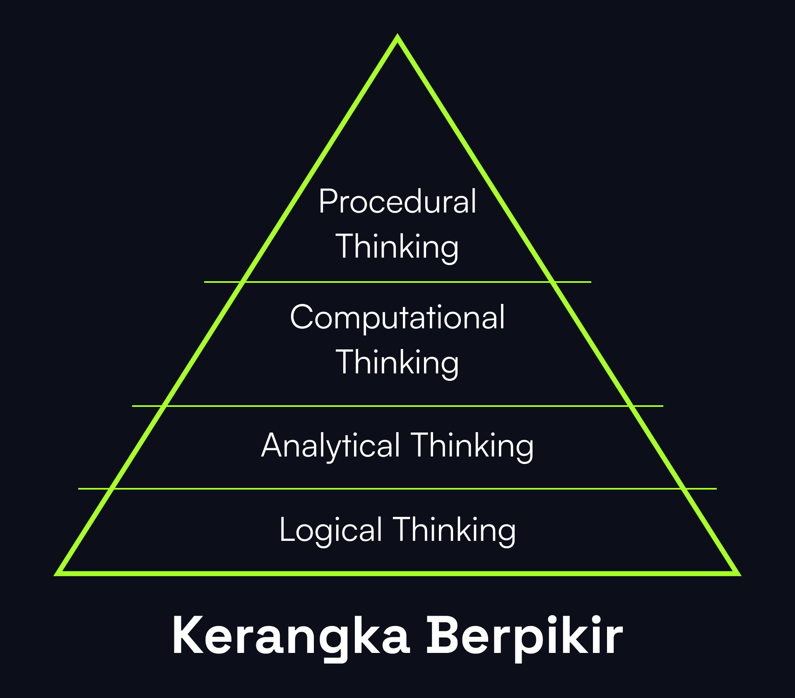
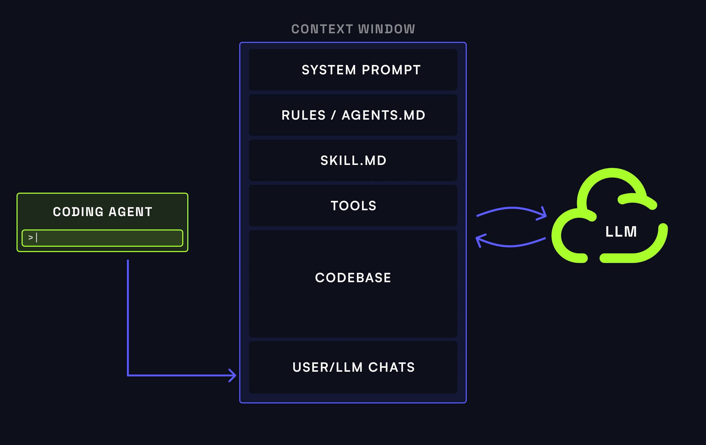
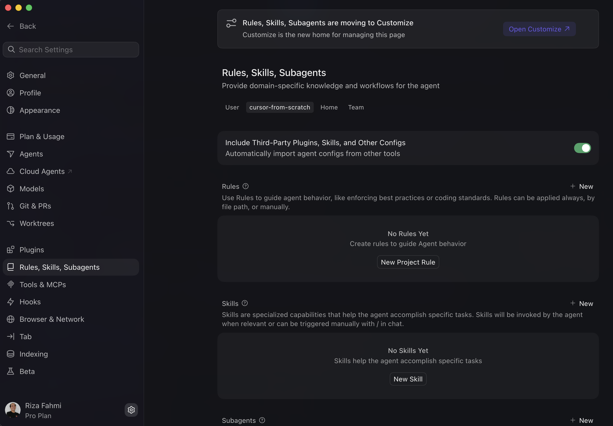

* Personalisasi Agen Cursor
#+OPTIONS: toc:nil

Materi untuk Cursor.id Meetup Agustus: personalisasi & workflow Cursor agent.

** Pembuka
LLM sifatnya sulit diprediksi atau "liar". Satu perintah bisa bisa diintrepretasikan berbeda-beda oleh LLM. Mari kita lihat contoh prompt yang bisa beragam artinya.

#+BEGIN_SRC text
Buat aplikasi web yang menampilkan tanggal dan jam saat ini secara realtime
#+END_SRC

Lalu bagaimana solusinya? Perbaiki cara komunikasinya. Set ekspekasi, jelaskan sedetil mungkin.

Intinya kita harus *memikirkan apa yang mau kita buat dan bagaimana caranya dan komunikasikan ke LLM*. Kalau kita tidak tahu mau bikin apa, apalagi LLM?!

Alat bantunya banyak wujudnya. Ada piramida berpikir, 5w1h, dan banyak lagi.

#+CAPTION: Contoh thinking framework
#+NAME:   fig:ThinkingFramework

Berikut contoh pemetaannya:
- Logical thinking: apa yang mau kita buat. Biasanya dalam format product brief atau product description.
- Analytical thinking: apa yang dibutuhkan untuk membuatnya. Biasanya direpresentasikan sebagai tech stack yang digunakan
- Computational thinking: penjelasan mendetil dari apa yang mau kita buat. Bisa direpresentasikan sebagai fitur-fitur utama yang mau dikembangkan. Dipisah menjadi slices atau milestone.
- Procedural thinking: Bagaimana membuatnya agar terwujud. Dengan cara memberikan informasi sedetil mungkin.

Umumnya, kombinasi diatas merupakan representasi dari PRD, SPEC, atau dokumen lainnya.

Mari kita coba wujudkan dari /prompt/ yang kurang jelas menjadi lebih lengkap dan terstruktur dengan fitur-fitur yang ada di Cursor. Tapi sebelum itu, mari kita samakan persepsi terlebih dahulu dengan melihat cara kerja /coding agent/ dibelakang layar. Apa yang terjadi ketika kita mengetikkan instruksi lalu mengirimnya?

#+CAPTION: cara kerja coding agent
#+NAME: agentic-loop.png

*** Agenda

#+TOC: headlines 2 local

Referensi: [[https://cursor.com/docs/customize-cursor]]

** Memberi Instruksi dengan RULES / AGENTS.MD
Agar hasil sesuai ekspektasi, selalu tambahkan instruksi yang jelas: mau buat apa, buatnya pakai apa, fiturnya apa saja dan bagaimana langkah-langkahnya.

Karena LLM tidak bisa mengingat apapun, setiap kali mengirim perintah atau /prompt/, instruksi ini harus disertakan.

Cursor menyediakan [[https://cursor.com/docs/rules][Rules]] atau bisa juga menggunakan [[https://agents.md][AGENTS.md]] yang lebih umum digunakan. Akan disimpan di =.cursor/rules= dengan format =mdc= atau markdown for cursor.

Beberapa hal yang sebaiknya ada di rules:
- penjelasan singkat tentang proyek
- bagaimana cara kerja dan cara menjalankan proyek
- /coding standard/ atau arsitektur

Contoh struktur file dan folder untuk rules:

#+BEGIN_SRC
.cursor/rules/
  react-patterns.mdc       # Recognized as a project rule
  api-guidelines.md        # Ignored (wrong extension)
  frontend/                # Organize rules in folders
    components.mdc
#+END_SRC

*** Rules dasar
Mari kita coba praktekkan penggunaan rules. Untuk membuat rules, bisa langsung menuju folder =.cursor/rules= dan buat file =*.mdc= disana, atau melalui menu setting di cursor.

Isi nama dan deskripsikan aturannya.

#+BEGIN_SRC markdown
# Project: Show date and time realtime

## Tech Stack (non-negotiable)
- Frontend: Astro + TypeScript
- Styling: vanilla css
- No backend

## Product Constraints
- Theme: lime green
- Accessibility: big text, big buttons, readable type, clear color combination
#+END_SRC

Menariknya di cursor kita bisa memberi kondisi kapan saja rules ini berlaku: Always Apply, Apply Intelligently, Apply to Specific Files, dan Apply Manually.

Sekarang, dengan aturan yang baru ditetapkan, mari kita coba dengan /prompt/ generik.

#+BEGIN_SRC
refactor
#+END_SRC

Perintah /refactor/ diatas bisa dibilang tidak jelas dan bisa banyak interpretasi. Apa yang perlu di refactor? Apakah teknologinya, kodenya, testing, dsb.

Namun karena kita sudah memasang aturan, LLM sedikit banyak akan mengerti bahwa kondisi proyek saat ini belum memenuhi aturan yang dibuat sehingga proses refactor akan dijalankan.

*** Rules untuk /testing/
Sekarang mari tambahkan aturan untuk selalu membuat /testing/.

#+BEGIN_SRC markdown
 # Project: Show date and time realtime
 
 ## Tech Stack (non-negotiable)
 - Frontend: Astro + TypeScript
 - Styling: vanilla css
 - No backend
- Testing: Vitest + Astro
 
 ## Product Constraints
 - Theme: lime green
 - Accessibility: big text, big buttons, readable type, clear color combination
 
## Engineering Constraints
- Keep behavior deterministic and testable
- Add test for core business logic
#+END_SRC

Lakukan perintah =refactor= lagi untuk melihat perbedaan hasilnya dari sebelumnya.

*** COMMENT Tambahkan beberapa batasan lainnya

#+BEGIN_SRC markdown
# Project: Show date and time realtime

## Tech Stack (non-negotiable)
- Frontend: Astro + TypeScript
- Styling: vanilla css
- No backend
- Testing: Vitest + Astro

## Product Constraints
- Theme: lime green
- Accessibility: big text, big buttons, readable type, clear color combination

## Engineering Constraints
- Keep behavior deterministic and testable
- Add test for core business logic
- Keep 3rd party libraries to bare minimum
- Pin library version in package.json
- Prefer small components, clear naming, minimal abstraction
#+END_SRC

Lakukan perintah =refactor= lagi untuk melihat perbedaan hasilnya dari sebelumnya.

*** COMMENT Menambahkan gaya pemrograman

#+BEGIN_SRC markdown
 Project: Show date and time realtime

## Tech Stack (non-negotiable)
- Frontend: Astro + TypeScript
- Styling: vanilla css
- No backend
- Testing: Vitest + Astro

## Product Constraints
- Theme: lime green
- Accessibility: big text, big buttons, readable type, clear color combination

## Engineering Constraints
- Keep behavior deterministic and testable
- Add test for core business logic
- Keep 3rd party libraries to bare minimum
- Pin library version in package.json
- Prefer small components, clear naming, minimal abstraction

## TypeScript-specific
Prefer functional programming style over imperative style in TypeScript
#+END_SRC

Lakukan perintah =refactor= lagi untuk melihat perbedaan hasilnya dari sebelumnya.

** Menambahkan Skill
[[https://cursor.com/docs/skills][Skill]] adalah /open standard/ untuk membuat LLM lebih "pintar" dengan cara mengajari agen untuk mengerjakan tugas-tugasnya.
Skill ini sifatnya lebih portable, dapat digunakan di satu proyek atau proyek lainnya. Berbeda dengan rules yang mungkin akan selalu disertakan bersama dengan perintah atau /prompt/, skill ini lebih bersifat fleksibel sehingga dapat digunakan saat diperlukan saja oleh LLM. Jika LLM merasa tidak perlu skill tambahan, maka skill tidak akan digunakan.

*** Contoh Skill: Tidy TDD

#+BEGIN_SRC markdown
For each next task, please do implement the test, then implement only enough code to make that test pass.

# CORE DEVELOPMENT PRINCIPLES
- Always follow the TDD cycle: Red → Green → Refactor
- Write the simplest failing test first
- Implement the minimum code needed to make tests pass
- Refactor only after tests are passing
- Follow Beck's "Tidy First" approach by separating structural changes from behavioral changes
- Maintain high code quality throughout development

# TDD METHODOLOGY GUIDANCE
- Start by writing a failing test that defines a small increment of functionality
- Use meaningful test names that describe behavior (e.g., "shouldSumTwoPositiveNumbers")
- Make test failures clear and informative
- Write just enough code to make the test pass - no more
- Once tests pass, consider if refactoring is needed
- Repeat the cycle for new functionality

# TIDY FIRST APPROACH
- Separate all changes into two distinct types:
  1. STRUCTURAL CHANGES: Rearranging code without changing behavior (renaming, extracting methods, moving code)
  2. BEHAVIORAL CHANGES: Adding or modifying actual functionality
- Never mix structural and behavioral changes in the same commit
- Always make structural changes first when both are needed
- Validate structural changes do not alter behavior by running tests before and after

# COMMIT DISCIPLINE
- Only commit when:
  1. ALL tests are passing
  2. ALL compiler/linter warnings have been resolved
  3. The change represents a single logical unit of work
  4. Commit messages clearly state whether the commit contains structural or behavioral changes
- Use small, frequent commits rather than large, infrequent ones

# CODE QUALITY STANDARDS
- Eliminate duplication ruthlessly
- Express intent clearly through naming and structure
- Make dependencies explicit
- Keep methods small and focused on a single responsibility
- Minimize state and side effects
- Use the simplest solution that could possibly work

# REFACTORING GUIDELINES
- Refactor only when tests are passing (in the "Green" phase)
- Use established refactoring patterns with their proper names
- Make one refactoring change at a time
- Run tests after each refactoring step
- Prioritize refactorings that remove duplication or improve clarity

# EXAMPLE WORKFLOW

When approaching a new feature:
1. Write a simple failing test for a small part of the feature
2. Implement the bare minimum to make it pass
3. Run tests to confirm they pass (Green)
4. Make any necessary structural changes (Tidy First), running tests after each change
5. Commit structural changes separately
6. Add another test for the next small increment of functionality
7. Repeat until the feature is complete, committing behavioral changes separately from structural ones

Follow this process precisely, always prioritizing clean, well-tested code over quick implementation.
Always write one test at a time, make it run, then improve structure. Always run all the tests (except long-running tests) each time.
#+END_SRC

**** Pengembangan fitur

Menampilkan tiga bagian waktu Indonesia.

#+BEGIN_SRC text
Untuk waktu di Indonesia ada tiga bagian: Waktu Indonesia Barat (WIB), Waktu Indonesia Tengah (WITA) dan Waktu Indonesia Timur. Tambahkan ke aplikasi supaya ketiganya dapat dilihat sebagai perbandingan tanggal dan waktu
#+END_SRC

Mendeteksi lokasi pengguna.

#+BEGIN_SRC text
Deteksi lokasi user berada di zona waktu yang mana.
Highlight dan buat zona waktu nya menjadi lebih besar
dibandingkan zona waktu lain.
#+END_SRC

Menampilkan waktu dari kota/negara populer lainnya

#+BEGIN_SRC text
Saya ingin juga menampilkan zona waktu beberapa kota/negara
populer sebagai perbandingan.
#+END_SRC

**** Contoh Skill Lainnya
- [[https://impeccable.style][impeccable.style]]
- [[https://github.com/mattpocock/skills/][mattpocock/skills]]
** Delegasi Tugas dengan Subagent
Agent yang kita gunakan sejauh ini sifatnya generalis. Terkadang ada tugas yang membutuhkan spesialis. Cursor agent bisa mendelegasikan tugas tersebut ke subagent. Subagent juga dapat berjalan secara mandiri, punya context window sendiri, dan bisa dijalankan secara berbarengan sehingga tidak mengganggu agen utama.

Beberapa subagent yang sudah disediakan oleh Cursor:
- Explore: untuk pencarian dan analisa codebase
- Bash: Menjalankan perintah shell yang dibutuhkan
- Browser: Membuka dan menjalankan otomasi untuk aplikasi web
