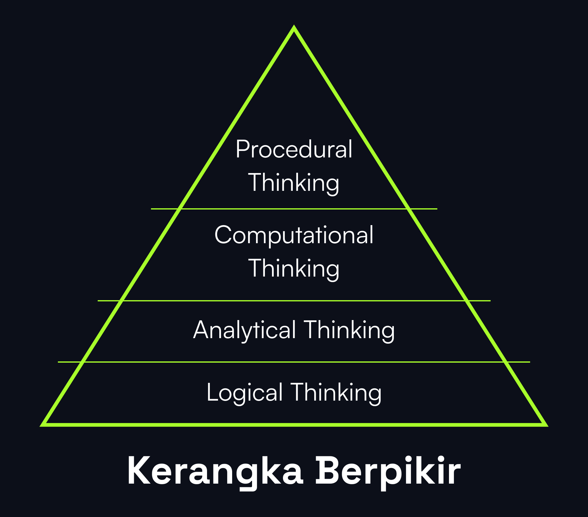
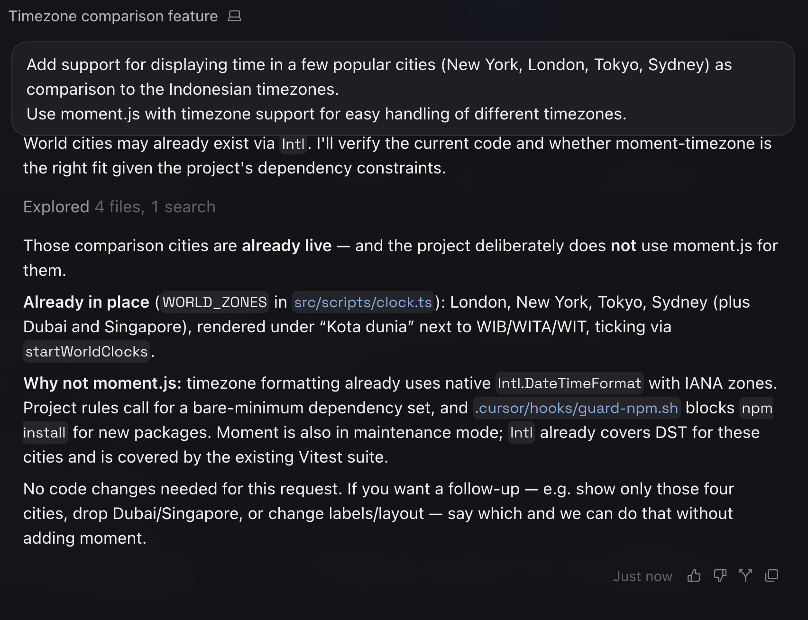
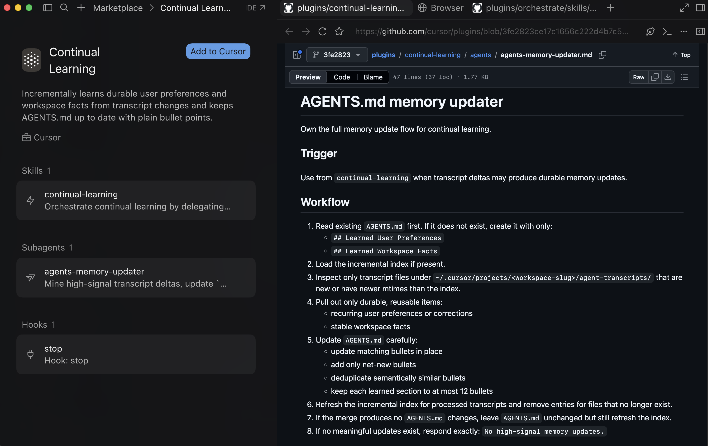

* Personalisasi Agen Cursor
#+OPTIONS: toc:nil

Materi untuk Cursor.id Meetup Agustus: personalisasi & workflow Cursor agent.

#+ATTR_HTML: :class sidenote
*Catatan:* Materi ini ditulis oleh manusia, dengan bantuan LLM.

** Pembuka

Pernah nge-prompt Cursor dan hasilnya jauh dari ekspektasi? Tenang, kamu nggak sendirian. LLM itu sifatnya "liar" - prompt yang sama bisa menghasilkan kode yang sangat berbeda. Materi ini bukan cuma tentang cara pakai Cursor, tapi cara /mengendalikan/ hasilnya melalui personalisasi.

Intinya: semakin baik kita mendefinisikan apa yang kita mau, semakin baik pula hasil yang diberikan Cursor. Prompt yang bagus tetap penting, tapi fondasi yang kuat - rules + skills + workflow - memastikan konsistensi tanpa perlu menulis ulang instruksi setiap kali.

*** Yang Akan Kamu Pelajari

Di akhir sesi ini, kamu akan bisa:
- Rules (=.cursor/rules=) → Memberikan konsistensi dan alignment proyek
- Skills → Mengajarkan LLM cara kerja yang lebih baik dan portable
- Subagent → Memberikan spesialisasi tugas
- Hooks → Memberikan kontrol dan guardrail otomatis
- Customization Marketplace → Memanfaatkan pengetahuan komunitas

*** Mode Interaksi Cursor

Sebelum mulai, mari kita kenalan dulu: *Cursor* adalah code editor berbasis VS Code yang punya AI / LLM bawaan untuk bantu kita menulis kode. Jadi bukan cuma text editor biasa - Cursor bisa membaca seluruh isi proyek kita, mengedit file, menjalankan perintah terminal, dan membaca hasilnya. Inilah yang disebut /coding agent/: AI yang bisa melihat file proyek, mengedit kode, menjalankan perintah terminal, dan membaca hasilnya - bukan cuma chat biasa kayak ChatGPT.

PENTING: Cursor punya beberapa mode interaksi. Materi ini mengasumsikan kamu menggunakan *Agent mode* (bisa diakses via =Cmd+I= di macOS atau =Ctrl+I= di Windows/Linux - jika shortcut nggak bekerja, periksa Settings → Keyboard Shortcuts atau ganti mode dari dropdown di kanan atas jendela Cursor. Shortcut diatas berdasarkan keyboard QWERTY; kalau pakai layout lain, shortcut bisa dikustomisasi di Preferences → Keyboard Shortcuts), bukan Chat mode. Agent mode bisa membaca proyek, mengedit file, dan menjalankan terminal - Chat mode hanya untuk tanya-jawab.

Nah, LLM (Large Language Model - model AI yang bisa memahami dan menghasilkan teks, contohnya GPT-4, Claude, Gemini) ini sifatnya sulit diprediksi atau "liar" - tanpa system prompt yang jelas dan pada temperature default, LLM cenderung memberikan hasil yang bervariasi untuk prompt yang sama. Satu perintah bisa bisa diinterpretasikan berbeda-beda oleh LLM. Mari kita lihat contoh prompt yang bisa beragam artinya.

#+BEGIN_SRC text
Buat aplikasi web yang menampilkan tanggal dan jam saat ini secara realtime
#+END_SRC

Prompt diatas sederhana banget, tapi bisa diinterpretasikan dengan cara yang sangat berbeda. Coba lihat:
- Interpretasi A: CLI tool yang nge-print date ke terminal setiap detik
- Interpretasi B: Full-stack web app dengan WebSocket untuk real-time update
- Interpretasi C: Static page dengan JavaScript =setInterval= sederhana

Hasilnya bisa beda jauh kan? Padahal prompt-nya sama persis. Inilah kenapa kita perlu struktur.

Contoh 5W1H untuk prompt yang sama:
(Catatan: Contoh diatas pakai Astro untuk ilustrasi. Kamu bisa ganti tech stack sesuai kebutuhan proyekmu - yang penting konsisten antara deskripsi 5W1H dan implementasi aktual.)
- =What=: Aplikasi web yang menampilkan waktu realtime dengan perbandingan zona waktu
- =Why=: Membandingkan zona waktu Indonesia dengan kota global
- =Who=: Pengguna yang perlu koordinasi lintas zona waktu
- =Where=: Browser desktop dan mobile
- =When=: Digunakan kapan saja, update setiap detik
- =How=: Astro + vanilla CSS + JavaScript =setInterval=

Lalu bagaimana solusinya? Gunakan framework seperti 5W+1H (What, Why, Who, Where, When, How) atau user-story template untuk memastikan prompt mencakup: aktor, aksi, input, output, dan batasan - bukan cuma "sedetil mungkin" tanpa arah.

Intinya, kita harus *memikirkan apa yang mau kita buat, bagaimana cara membuatnya, dan cara mengomunikasikannya ke LLM*. LLM tidak bisa membaca pikiran - jika instruksi kita tidak eksplisit, hasilnya akan bergantung sepenuhnya pada bias training data-nya. Jadi kalau kita sendiri nggak jelas mau bikin apa, jangan kaget kalau hasilnya juga ngaco.

Sekarang, sebelum kita masuk ke kerangka berpikir, mari kita samakan persepsi dulu dengan melihat cara kerja /coding agent/ dibelakang layar. Apa yang terjadi ketika kita mengetikkan instruksi lalu mengirimnya?

💡 Ingin mencoba tapi takut merusak? Aturan dan hook bisa dinonaktifkan sementara: rename file rule, atau hapus hook dari =hooks.json=. Untuk pengujian yang aman, gunakan branch git terpisah.

#+CAPTION: Cara kerja coding agent: dari prompt user → agent membaca konteks proyek → menjalankan aksi (edit file, jalankan terminal, dsb) → mengembalikan hasil, lalu berulang dalam /agentic loop/
#+NAME: agentic-loop.png
[[./agentic-loop.png][Diagram agentic loop: prompt user → agent membaca konteks → menjalankan aksi (edit/terminal) → hasil → ulangi]]

⚠️ Agent bekerja dalam loop: setelah menjalankan aksi, ia membaca hasil dan memutuskan langkah selanjutnya. Kalau agent terlihat stuck dalam loop (misal terus mencoba dan gagal), kamu bisa menghentikannya dengan tombol Stop di sidebar, atau tekan Escape.

*** Prasyarat

Sebelum lanjut, pastikan kita sudah siapin hal-hal berikut:
- Sudah install Cursor (download dari [[https://cursor.com][cursor.com]] - jika terkendala, pastikan nggak diblokir firewall/vpn korporat. Kalau masih gagal, coba dari terminal: =cursor .= setelah install)
- Sudah punya akun dan login (bisa pakai Google atau GitHub - jika gagal login, coba periksa koneksi atau gunakan password-based login lewat Settings → Account)
- Sudah punya proyek, bisa proyek kosong (nanti kita buat bareng)
- Familiar dengan basic terminal (=cd=, =mkdir=, =ls=) dan git (=git init=, =git add=, =git commit=)
- [[https://jqlang.github.io/jq/][jq]] terinstall untuk menggunakan hooks (cek dengan =which jq= di macOS/Linux atau =where jq= di Windows; install dengan =brew install jq= di macOS, =apt install jq= di Linux, atau =winget install jqlang.jq= di Windows - bisa juga download dari [[https://jqlang.github.io/jq/download/][jqlang.github.io/jq/download]])
- Kalau kamu familiar dengan VS Code, kamu akan merasa di rumah. Kalau belum pernah, jangan khawatir - navigasi dasarnya intuitif: sidebar kiri (=⌘B=) untuk file explorer, =Cmd+Shift+P= untuk command palette
- (Rules dan settings Cursor bersifat per-folder: Cursor akan mencari folder =.cursor= di direktori yang dibuka. Untuk monorepo, taruh =.cursor= di root repo, bukan di sub-packages.)

*** Quick Start (5 Menit Pertama)

Baru pertama kali dan mau langsung nyoba? Ikuti 3 langkah ini:

1. Buka proyek kamu di Cursor (atau buat folder baru). Kalau Cursor nggak bisa membuka folder, coba buka dari terminal dengan =cursor .= atau pastikan kamu sudah menginstall Cursor dengan benar.
2. Buat file =.cursor/rules/project-info.mdc= dan isi dengan:
   #+BEGIN_SRC markdown
   # Project: [nama proyek kamu]

   ## Tech Stack
   - [teknologi yang kamu pakai]

   ## Aturan Penting
   - [aturan spesifik proyek kamu]
   #+END_SRC
3. Kirim prompt pertama kamu ke agent Cursor (bisa lewat =Cmd+I= di macOS atau =Ctrl+I= di Windows/Linux)

Itu aja! Kamu sudah punya fondasi personalisasi. Lanjut baca materi diatas untuk level selanjutnya.

*** Agenda

#+TOC: headlines 2 local

Referensi: [[https://cursor.com/docs/customize-cursor]]

** Kerangka Berpikir untuk Prompt yang Efektif

Alat bantunya banyak wujudnya. Dua kerangka yang akan kita gunakan di materi ini adalah *piramida berpikir* (kerangka untuk memecah masalah dari abstrak ke konkret, makin ke bawah makin detail), dan *5W1H* (metode menjawab =What=/=Why=/=Who=/=Where=/=When=/=How= untuk menjelaskan sesuatu secara lengkap).

#+CAPTION: Contoh thinking framework: piramida berpikir memecah masalah dari abstrak (atas) ke konkret (bawah). Logical → Analytical → Computational → Procedural.
#+NAME:   fig:ThinkingFramework

(Gambar membutuhkan file di direktori yang sama. Jika tidak muncul, pastikan sudah =git pull= dengan benar atau buka langsung di Cursor.)

Mengapa ini penting untuk LLM? Karena LLM melihat seluruh instruksi dalam jendela konteks sekaligus - semakin abstrak instruksi, semakin banyak asumsi yang harus dibuat model untuk mengisi kekosongan detail. Dengan memecah dari abstrak ke konkret, kita mengurangi ruang interpretasi di setiap langkah. Bayangkan seperti kita ngasih petunjuk ke orang: kalau kita cuma bilang "bikin aplikasi", hasilnya bisa macem-macem. Tapi kalau kita jelasin dari konsep besar sampai detail teknis, hasilnya jauh lebih terarah.

Berikut contoh pemetaannya, dari yang paling abstrak ke yang paling konkret:

*** Logical thinking: /apa/ yang mau kita buat
Ini level paling atas - kita mendefinisikan ide besarnya. Untuk contoh kali ini, kita representasikan dalam format /product brief/ atau /product description/. Contoh: "Aplikasi web yang menampilkan tanggal dan jam realtime untuk berbagai zona waktu di Indonesia."

*** Analytical thinking: /apa yang dibutuhkan/ untuk membuatnya
Di level ini kita tentukan alat dan bahannya. Untuk contoh kali ini, kita representasikan sebagai /tech stack/ yang digunakan. Contoh: "Frontend pakai Astro + TypeScript, styling pakai vanilla CSS, nggak perlu backend."

*** Computational thinking: penjelasan /mendetil/ dari apa yang mau kita buat

Di sini kita pecah ide besar jadi bagian-bagian kecil yang bisa dikerjakan. Bisa direpresentasikan sebagai fitur-fitur utama, lalu dipisah menjadi *slices* (potongan fitur kecil yang bisa dikerjakan dan di-review dalam satu waktu), *milestone* (tonggak pencapaian dalam pengembangan), *user stories* (deskripsi fitur dari sudut pandang pengguna), tiket, dll.

*** Procedural thinking: /bagaimana/ membuatnya agar terwujud
Level paling konkret - kita kasih instruksi sedetil mungkin. Contoh: batasan proyek, fitur apa yang dipilih untuk dikembangkan, mana yang belum perlu dikembangkan, dan fitur mana yang "dibuang". Juga termasuk /coding standard/, aturan testing, dan workflow yang kita mau.

Keempat lapisan diatas adalah kerangka yang kita adaptasi dari berbagai framework pemecahan masalah (seperti Bloom's taxonomy dan computational thinking) - khusus disederhanakan untuk memudahkan kita ngasih instruksi ke coding agent.

Jika keempat lapisan ini didokumentasikan secara lengkap, hasilnya setara dengan *PRD* (Product Requirements Document - dokumen yang menjelaskan fitur apa yang harus dibuat) atau *SPEC* (spesifikasi teknis - dokumen yang menjelaskan bagaimana cara membuatnya), tergantung seberapa teknis detail yang kita tulis.

Mari kita coba wujudkan dari /prompt/ yang kurang jelas menjadi lebih lengkap dan terstruktur dengan fitur-fitur yang ada di Cursor - dimulai dari rules di bagian berikutnya.

** Memberi Instruksi dengan RULES / AGENTS.MD
Untuk hasil yang konsisten dan sesuai ekspektasi pada tugas yang kompleks, sebaiknya tambahkan instruksi yang jelas: mau buat apa, buatnya pakai apa, fiturnya apa saja dan bagaimana langkah-langkahnya. Untuk tugas sederhana (satu baris, satu file), instruksi minimal mungkin sudah cukup.

LLM tidak memiliki memori lintas sesi - setiap sesi baru dimulai dari konteks kosong. Di dalam satu sesi, instruksi perlu diulang jika konteks sudah melebihi jendela konteks (context window) atau jika instruksi awal sudah "tergeser" oleh percakapan panjang.

Cursor menyediakan [[https://cursor.com/docs/rules][Rules]] atau bisa juga menggunakan [[https://agents.md][AGENTS.md]] yang lebih umum digunakan. Rules disimpan di folder =.cursor/rules= dengan format =.mdc= (Markdown for Cursor - format markdown khusus Cursor yang bisa punya metadata seperti =glob= pattern untuk menentukan file mana saja yang aturannya berlaku, dan =alwaysApply= untuk menentukan kapan aturan dipakai).

Catatan: Versi lama Cursor menggunakan file =.cursorrules= di root proyek. Format ini sudah digantikan oleh folder =.cursor/rules/=. Kalau kamu punya =.cursorrules= yang sudah ada, Cursor masih membacanya untuk backward compatibility, tapi direkomendasikan untuk migrasi ke format baru.

Beberapa hal yang sebaiknya ada di rules:
- penjelasan singkat tentang proyek
- bagaimana cara kerja dan cara menjalankan proyek
- /coding standard/ atau arsitektur

Contoh struktur file dan folder untuk rules:

#+BEGIN_SRC text
.cursor/rules/
  react-patterns.mdc       # Recognized as a project rule
  api-guidelines.md        # ⚠️ DIABAIKAN - ekstensi harus .mdc, bukan .md
                           # (Jika ada file .md dan .mdc dengan nama sama, hanya .mdc yang diproses; .md diabaikan tanpa peringatan)
  frontend/                # Organize rules in folders
    components.mdc
#+END_SRC

Perhatikan ukuran rules: setiap rule ditambahkan ke konteks setiap kali agent dipanggil. Rule yang terlalu besar bisa mengurangi "daya pikir" agent karena token habis dipakai untuk konteks. Sebagai panduan, usahakan setiap rule tidak lebih dari ~50 baris - tapi ini bukan batas keras dari Cursor, jadi kalau aturannya kompleks, pertimbangkan pakai =glob= pattern untuk membatasi relevansi. Kalau total semua rule melebihi kapasitas konteks, Cursor akan memangkas otomatis - aturan dengan prioritas lebih rendah atau kurang relevan akan dihilangkan lebih dulu.

Jika ada konflik antar rule, aturan dengan =glob= pattern yang lebih spesifik akan diutamakan. Hindari duplikasi atau instruksi yang saling bertentangan - untuk konflik yang nggak bisa diresolve oleh glob, Cursor akan menggabungkan kedua aturan, dan kalau bertentangan, hasilnya nggak bisa dijamin.

Contoh isi file =.cursor/rules/frontend/components.mdc=:
#+BEGIN_SRC markdown
---
description: Component patterns for this project
glob: src/components/**/*.{tsx,astro}
alwaysApply: false
---
Gunakan functional components dengan TypeScript. Hindari class components.
Semua komponen harus punya unit test.
#+END_SRC

*** Rules dasar
Mari kita coba praktikkan penggunaan rules. Untuk membuat rules, ada dua cara:

1. *Lewat terminal*: Buka terminal, =cd= ke folder proyek kamu, lalu jalankan:
   #+BEGIN_SRC bash
   mkdir -p .cursor/rules
   #+END_SRC
   Kemudian buat file baru dengan ekstensi =.mdc= di dalam folder tersebut, misalnya =project-rules.mdc=.
2. *Lewat UI Cursor*: Buka Cursor → klik ikon Settings (⚙️) di sidebar kiri → pilih tab *Rules* → klik tombol =+ New Rule=. Sebuah form akan muncul seperti gambar di bawah.

#+CAPTION: Tampilan form untuk membuat rule baru di Cursor. Isi nama rule dan deskripsikan aturannya sesuai kebutuhan proyek.
#+NAME:   fig:Setting
[[./setting.png][Screenshot form Create New Rule di Cursor: input nama rule dan deskripsi aturan]]

Isi nama dan deskripsikan aturannya.

#+BEGIN_SRC markdown
# Project: Show date and time realtime

## Tech Stack (non-negotiable)
- Frontend: Astro + TypeScript
- Styling: vanilla css
- No backend

## Product Constraints
- Theme: lime green
- Accessibility: big text, big buttons, readable type, clear color combination
#+END_SRC

Menariknya di Cursor kita bisa memberi kondisi kapan saja rules ini berlaku. Ada empat mode yang bisa dipilih:
- *Always Apply*: Aturan dipakai di /setiap/ prompt, nggak peduli konteksnya apa.
- *Apply Intelligently*: Cursor yang memutuskan sendiri kapan aturan ini relevan berdasarkan isi prompt.
- *Apply to Specific Files*: Aturan cuma berlaku untuk file yang cocok dengan =glob= pattern (misal =*.tsx= untuk file React, atau =*.test.ts= untuk file testing).
- *Apply Manually*: Kamu yang panggil sendiri lewat =@Rules= saat lagi butuh.

Sekarang, dengan aturan yang baru ditetapkan, mari kita coba dengan /prompt/ generik.

#+BEGIN_SRC text
refactor
#+END_SRC

Perintah /refactor/ diatas bisa dibilang tidak jelas dan bisa banyak interpretasi. Apa yang perlu di refactor? Apakah teknologinya, kodenya, testing, dsb.

Namun karena kita sudah memasang aturan, rules tersebut akan disertakan sebagai bagian dari system prompt setiap kali kamu mengirim perintah ke LLM. Dengan adanya instruksi "refactor code to match project conventions" di rules, LLM akan memprioritaskan perubahan yang menyelaraskan kode dengan aturan yang sudah ditetapkan.

*** Rules untuk /testing/
Sekarang mari tambahkan aturan untuk selalu membuat /testing/.

(Catatan singkat buat yang baru kenal: *Astro* adalah framework web untuk bikin website statis/interaktif. *TypeScript* adalah JavaScript dengan tipe data. *Vitest* adalah tools untuk menjalankan test, mirip Jest. *3rd party libraries* atau pustaka pihak ketiga adalah kode orang lain yang kita pasang biar nggak perlu nulis dari nol, dan =package.json= adalah file di proyek JavaScript/TypeScript yang mendaftarkan library yang terpasang. Nggak perlu khawatir kalau belum familiar - yang penting kita paham konsepnya dulu.)

Yang kita tambahkan ke rules:

- Testing: Vitest + Astro

## Engineering Constraints
- Keep behavior deterministic and testable
- Add test for core business logic

Lakukan perintah =refactor= lagi untuk melihat perbedaan hasilnya dari sebelumnya.

*** Latihan: Tambahkan beberapa batasan lainnya

Yang kita tambahkan ke rules:

- Keep 3rd party libraries to bare minimum
- Pin library version in package.json
- Prefer small components, clear naming, minimal abstraction

Lakukan perintah =refactor= lagi untuk melihat perbedaan hasilnya dari sebelumnya.

*** Latihan: Menambahkan gaya pemrograman

Yang kita tambahkan ke rules:

## TypeScript-specific
Prefer functional programming style over imperative style in TypeScript

Lakukan perintah =refactor= lagi untuk melihat perbedaan hasilnya dari sebelumnya.

Oh iya, selain rules, Cursor juga mendukung konfigurasi lewat =.cursor/settings.json= (misal: pilih model default, aktifkan mode YOLO, atur perilaku agent). Pastikan JSON-nya valid, nggak boleh ada trailing comma. Kalau setting nggak berefek, coba restart Cursor.

** Menambahkan Skill
[[https://cursor.com/docs/skills][Skill]] adalah format berbasis markdown yang terdokumentasi secara publik - sehingga bisa dibagikan antar pengguna dan, dalam beberapa kasus, digunakan di tools lain yang mendukung format serupa. Meskipun belum menjadi standar resmi (seperti ISO atau W3C), format ini cukup terbuka untuk diadopsi dan bisa kamu download dari repo GitHub orang lain. Perlu diingat: beberapa skill mungkin membutuhkan dependensi tertentu atau ditulis untuk framework spesifik - periksa isi skill sebelum menggunakannya.
Skill ini sifatnya lebih portable - formatnya distandarisasi sehingga bisa dipakai di berbagai proyek tanpa perlu menyalin ulang. Berbeda dengan rules yang lebih terikat ke proyek dan kondisi penggunaannya bisa diatur (Always Apply, Apply Intelligently, Apply to Specific Files, atau Apply Manually). Skill hanya digunakan saat relevan: Cursor akan mengevaluasi apakah skill tersebut cocok dengan prompt yang kamu kirim. Jika skor relevansinya rendah, skill tidak akan disertakan ke dalam konteks. Kalau kamu merasa skill seharusnya aktif tapi nggak dipakai, kamu bisa menyebutkan nama skill secara eksplisit di prompt (misal "Gunakan skill TDD untuk task ini"). Atau setel rule dengan =alwaysApply= sebagai fallback.

*** Contoh Skill: Tidy TDD

Skill ini menerapkan *TDD (Test-Driven Development)* - cara menulis kode dengan membuat /test dulu/, baru menulis kode agar test-nya lulus. Siklusnya: *Red* (test gagal) → *Green* (test lulus) → *Refactor* (perbaiki struktur kode tanpa mengubah perilaku). Ditambah pendekatan *Tidy First* dari Kent Beck (salah satu penemu TDD) yang memisahkan perubahan struktur kode (=rename=, =extract method=) dari perubahan logika - jangan pernah campur keduanya dalam satu commit.

#+BEGIN_SRC markdown
For each next task, please do implement the test, then implement only enough code to make that test pass.

# CORE DEVELOPMENT PRINCIPLES
- Always follow the TDD cycle: Red → Green → Refactor
- Write the simplest failing test first
- Implement the minimum code needed to make tests pass
- Refactor only after tests are passing
- Follow Beck's "Tidy First" approach by separating structural changes from behavioral changes
- Maintain high code quality throughout development

# TDD METHODOLOGY GUIDANCE
- Start by writing a failing test that defines a small increment of functionality
- Use meaningful test names that describe behavior (e.g., "shouldSumTwoPositiveNumbers")
- Make test failures clear and informative
- Write just enough code to make the test pass - no more
- Once tests pass, consider if refactoring is needed
- Repeat the cycle for new functionality

[Sisa isi skill dipotong - cari "Tidy TDD skill" di GitHub atau [[https://cursor.com/docs/skills][dokumentasi Skills Cursor]] untuk versi lengkap]
#+END_SRC

**** Pengembangan fitur

Latihan: gunakan prompt berikut bersama skill TDD diatas untuk mengembangkan fitur aplikasi date-time kita secara bertahap. Aplikasi yang sudah kita buat dengan aturan Astro + TypeScript dari bagian Rules sebelumnya akan kita kembangkan dengan tiga fitur baru.

(Catatan: *WIB* = Waktu Indonesia Barat (UTC+7), *WITA* = Waktu Indonesia Tengah (UTC+8), *WIT* = Waktu Indonesia Timur (UTC+9) - tiga zona waktu di Indonesia. Kamu bisa ganti dengan zona waktu yang relevan untuk lokasimu.)

Menampilkan tiga bagian waktu Indonesia.

#+BEGIN_SRC text
Untuk waktu di Indonesia ada tiga bagian: Waktu Indonesia Barat (WIB), Waktu Indonesia Tengah (WITA) dan Waktu Indonesia Timur. Tambahkan ke aplikasi supaya ketiganya dapat dilihat sebagai perbandingan tanggal dan waktu
#+END_SRC

Mendeteksi lokasi pengguna.

#+BEGIN_SRC text
Deteksi lokasi user berada di zona waktu yang mana.
Highlight dan buat zona waktu nya menjadi lebih besar
dibandingkan zona waktu lain.
#+END_SRC

Menampilkan waktu dari kota/negara populer lainnya

#+BEGIN_SRC text
Saya ingin juga menampilkan zona waktu beberapa kota/negara
populer sebagai perbandingan.
#+END_SRC

**** Contoh Skill Lainnya
- [[https://impeccable.style][impeccable.style]]
- [[https://github.com/mattpocock/skills/][mattpocock/skills]]

Kita juga bisa menambahkan hooks untuk guardrail dan otomatisasi - kita akan bahas lebih mendalam di bagian **Kustomisasi lebih lanjut dengan Hooks**.

(Catatan: Fitur skills tersedia di Cursor 0.45+. Cek versi kamu di Cursor → About.)

** Delegasi Tugas dengan Subagent
Agent yang kita gunakan sejauh ini sifatnya generalis. Terkadang ada tugas yang membutuhkan spesialis. Cursor agent bisa mendelegasikan tugas tersebut ke subagent - kamu bisa memanggil subagent secara eksplisit dari prompt (misalnya: "minta subagent Explore untuk mencari semua file yang mengimpor modul X"), atau Cursor akan otomatis memanggil subagent yang tepat untuk tugas spesifik seperti menjalankan perintah Bash. Subagent juga dapat berjalan secara mandiri, punya context window sendiri, dan bisa dijalankan secara berbarengan sehingga tidak mengganggu agen utama.

(Catatan: Fitur subagent tersedia di Cursor 0.45+. Cek versi kamu di Cursor → About.)

Beberapa subagent yang sudah disediakan oleh Cursor:
- Explore: untuk pencarian dan analisa codebase
- Bash: Menjalankan perintah shell yang dibutuhkan
- Browser: Membuka dan menjalankan otomasi untuk aplikasi web

*** Contoh Subagent Sederhana
Kita pun bisa meminta bantuan Cursor untuk membuat subagent lewat perintah =/create-subagent= di agent chat (mirip seperti slash command di aplikasi lain - ketik langsung di input chat agent):

#+BEGIN_SRC text
/create-subagent Help me create this subagent for Cursor: 
Monetization officer that inspects and evaluates the current project then plans for monetization opportunities. Ask questions for clarity, one question at a time until everything clear.
#+END_SRC

Ubah metadata subagent agar lebih lengkap.

#+BEGIN_SRC yaml
---
name: monetization-officer
model: claude-sonnet-4-20250514
description: Monetization officer that inspects and evaluates the current project, then plans monetization opportunities. Use only when explicitly asked to assess, plan, or recommend monetization. ALWAYS USE FOR PLAN MODE.
---
#+END_SRC

(Ganti =claude-sonnet-4-20250514= dengan model yang tersedia di akun Cursor kamu.
Lihat daftar model di Cursor → Settings → Models. Jika model nggak tersedia, Cursor akan menggunakan model default. Kalau nama model salah ketik, subagent mungkin gagal dibuat dengan pesan error di chat.)

Lalu jalankan perintah dengan bahasa natural saja.

#+BEGIN_SRC text
Let's find monetization opportunities for this project.
#+END_SRC
  
** Kustomisasi lebih lanjut dengan Hooks
Cara berikutnya untuk customize dan extend Cursor: Hooks memungkinkan kita menambahkan otomatisasi dan guardrail ke dalam workflow - misalnya memblokir perintah berbahaya sebelum dieksekusi, atau menjalankan formatter secara otomatis setelah agent selesai mengedit file. Intinya, hooks adalah skrip yang dieksekusi di trigger point yang diinginkan. Misalnya sebelum mengirim perintah ke LLM, sebelum menjalankan perintah shell, sebelum =npm install=, dsb.

Sebelumnya kita sudah lihat contoh hooks sederhana dengan file langsung di folder =.cursor/hooks/= (pendekatan simpel - cocok buat eksperimen cepat). Nah, Cursor juga punya cara yang lebih deklaratif lewat file =hooks.json= - kita bisa mendefinisikan trigger point dan script mana yang dijalankan secara lebih terstruktur (cocok buat workflow yang kompleks). Dua pendekatan ini bisa dipakai sesuai kebutuhan.

(Catatan: Fitur hooks tersedia di Cursor 0.45+. Hooks pakai bash script dan hanya berfungsi di macOS/Linux. Di Windows, kamu perlu WSL atau PowerShell - lihat [[https://cursor.com/docs/hooks][dokumentasi resmi Cursor]] untuk alternatifnya.)

Berikut beberapa contoh penggunaan hooks:
- Run formatters after edits
- Add analytics for events
- Check for security or secrets
- Gate risky operations (e.g., SQL writes)
- Write collaboration logs

Contoh =beforeSubmitPrompt= - secara otomatis menambahkan konteks proyek ke setiap prompt:

#+BEGIN_SRC bash
#!/bin/bash
read -r input
prompt=$(echo "$input" | jq -r '.prompt')
cat <<EOF
{
  "continue": true,
  "prompt": "Project: web-app with Astro + TypeScript\\n\\n---\\n\\n$prompt"
}
EOF
#+END_SRC

*** Menulis Hooks
Kita bisa menambahkan hooks untuk secara aktif mengecek dan memblokir perintah yang berpotensi merusak. Misalnya melakukan =npm install= sebuah pustaka yang menambahkan banyak dependensi baru dan melanggar aturan "Keep 3rd party libraries to bare minimum" yang sudah ditetapkan di rules.

**** =./cursor/hooks.json=

#+BEGIN_SRC json
{
  "version": 1,
  "hooks": {
    "beforeShellExecution": [
      {
        "command": ".cursor/hooks/guard-npm.sh"
      }
    ]
  }
}
#+END_SRC

**** =./cursor/hooks/guard-npm.sh=

#+BEGIN_SRC bash
#!/bin/bash
set -euo pipefail

# Fail-safe: jika jq tidak tersedia, tolak perintah
if ! command -v jq &>/dev/null; then
  cat <<EOF
{
  "continue": false,
  "permission": "deny",
  "userMessage": "⚠️ Hook misconfigured: jq not installed. Command blocked.",
  "agentMessage": "Cannot verify command because jq is missing."
}
EOF
  exit 0
fi

read -r input
command=$(echo "$input" | jq -r '.command')

if echo "$command" | grep -qE "\b(npm|yarn|pnpm|bun)\s+(install|i|add|dlx)\b"; then
  cat <<EOF
{
  "continue": false,
  "permission": "deny",
  "userMessage": "⚠️ New dependencies not allowed per Project Rules. Use existing ones only.",
  "agentMessage": "Respect 'Keep 3rd party libraries to bare minimum' constraint."
}
EOF
  exit 0
fi

# Allow everything else
cat <<EOF
{
  "continue": true,
  "permission": "allow"
}
EOF
#+END_SRC

Peringatan: Pattern matching sederhana seperti ini bisa dilewati - agent bisa mengedit =package.json= lalu menjalankan =npm install= (tanpa argumen) untuk menginstal dependensi baru. Untuk proteksi yang lebih ketat, kombinasikan hook ini dengan hooks =onFileChange= atau pre-commit hook git. Lihat [[https://cursor.com/docs/hooks][dokumentasi hooks Cursor]] untuk opsi trigger point lainnya.

Jika hook script gagal (non-zero exit) atau menghasilkan output JSON yang nggak valid, Cursor akan menganggap hook tersebut gagal dan - tergantung versi - mungkin memblokir aksi atau menampilkan peringatan. Selalu uji hook script secara terpisah sebelum dipasang.

Kalau ada beberapa hook untuk trigger yang sama, hook akan dieksekusi sesuai urutan di array. Jika ada satu hook yang mengembalikan "deny", maka aksi akan diblokir - meskipun hook lain mengembalikan "allow".

⚠️ =moment.js= sudah dalam mode maintenance-only dan tidak direkomendasikan untuk proyek baru.
Alternatif modern: =date-fns= atau =Intl.DateTimeFormat= bawaan JavaScript.
(Contoh dibawah sengaja menggunakan moment.js untuk mengilustrasikan hooks blocking - agent mungkin otomatis menyarankan alternatif modern.)

Coba dengan mengeksekusi perintah berikut

#+BEGIN_SRC text
Add support for displaying time in a few popular cities (New York, London, Tokyo, Sydney) as comparison to the Indonesian timezones.

Use moment.js with timezone support for easy handling of different timezones.
#+END_SRC

 
#+CAPTION: Contoh eksekusi hooks: saat agent mencoba =npm install=, hook guard-npm.sh memblokir dan memberi peringatan sesuai rules yang sudah ditetapkan
#+NAME:   fig:Hooks

** Customization Marketplace
Cursor juga menyediakan marketplace untuk kustomisasi - isinya macem-macem: ada yang berupa rules, ada yang berupa skills, subagents, atau hooks - bahkan ada yang mengombinasikan beberapa jenis sekaligus. Kita bisa menggunakan hasil kustomisasi buatan teman-teman komunitas. Cara mengaksesnya: buka Cursor → klik ikon puzzle (🧩) di sidebar kiri → pilih tab *Marketplace*. (Catatan: Marketplace memerlukan akun Cursor yang login. Beberapa item mungkin memerlukan subscription tertentu.) Atau langsung kunjungi [[https://cursor.com/marketplace][cursor.com/marketplace]].

Beberapa contoh yang bisa kamu eksplorasi:
- *Continual Learning*: skill yang mengajarkan agent untuk mencatat keputusan dan learnings dari sesi ke sesi - jadi agent kamu makin lama makin paham proyek.
- *Superpower*: koleksi shortcut dan optimasi workflow untuk produktivitas maksimal.
- *Compound Engineering*: pendekatan untuk mendokumentasikan solusi dari masalah yang sudah terpecahkan - supaya kita nggak ulangi kesalahan yang sama.

#+CAPTION: Contoh Customization Marketplace - kita bisa browse dan install kustomisasi buatan komunitas seperti Continual Learning, Superpower, atau Compound Engineering
#+NAME:   fig:continual-learning

*** Referensi
- [[https://cursor.com/docs/customize-cursor][Dokumentasi Resmi Kustomisasi Cursor]]
- [[https://cursor.com/docs/rules][Dokumentasi Rules]]
- [[https://cursor.com/docs/skills][Dokumentasi Skills]]
- [[https://cursor.com/docs/subagents][Dokumentasi Subagents]]
- [[https://cursor.com/docs/hooks][Dokumentasi Hooks]]
- [[https://cursor.com/marketplace][Cursor Marketplace]]

*** Glosarium

- *5W1H*: Metode menjawab What/Why/Who/Where/When/How untuk menjelaskan sesuatu secara lengkap - berguna banget buat struktur prompt.
- *Astro*: Framework web untuk bikin website statis dan interaktif.
- *Coding Agent*: AI yang bisa melihat file proyek, mengedit kode, menjalankan perintah terminal, dan membaca hasilnya - bukan cuma chat.
- *Cursor*: Code editor berbasis VS Code yang punya AI/LLM bawaan untuk bantu menulis kode.
- *Hooks*: Skrip yang dieksekusi otomatis di trigger point tertentu (misal =beforeSubmitPrompt=, =beforeShellExecution=).
- *=jq=*: Command-line tool untuk membaca dan mengolah JSON (wajib untuk hooks).
- *LLM (Large Language Model)*: Model AI yang bisa memahami dan menghasilkan teks. Contoh: GPT-4, Claude, Gemini.
- *=.mdc= (Markdown for Cursor)*: Format markdown khusus Cursor dengan dukungan metadata seperti =glob= dan =alwaysApply=.
- *Milestone*: Tonggak pencapaian dalam pengembangan - dipakai di lapisan Computational thinking.
- *Piramida Berpikir*: Kerangka empat lapisan (Logical → Analytical → Computational → Procedural) untuk memecah masalah dari abstrak ke konkret saat ngasih instruksi ke coding agent.
- *PRD (Product Requirements Document)*: Dokumen yang menjelaskan fitur apa yang harus dibuat - setara dengan dokumentasi lengkap keempat lapisan piramida berpikir.
- *Rules*: Instruksi yang selalu disertakan dalam setiap prompt untuk memberikan konteks proyek ke LLM.
- *Skills*: Modul portable yang mengajari LLM cara mengerjakan tugas spesifik (contoh: TDD, frontend design).
- *Slices*: Potongan fitur kecil yang bisa dikerjakan dan di-review dalam satu waktu.
- *SPEC (Spesifikasi Teknis)*: Dokumen yang menjelaskan bagaimana cara membuat fitur - setara dengan dokumentasi lengkap keempat lapisan piramida berpikir.
- *Subagent*: Agen spesialis yang bisa didelegasikan tugas tertentu oleh agen utama.
- *TDD (Test-Driven Development)*: Metodologi menulis kode dengan membuat test dulu, baru implementasi. Siklus: Red → Green → Refactor.
- *Tidy First*: Pendekatan dari Kent Beck yang memisahkan perubahan struktur kode dari perubahan logika.
- *Trigger Point*: Momen spesifik saat Cursor mengeksekusi hook (misal =beforeSubmitPrompt=, =beforeShellCommand=).
- *User Stories*: Deskripsi fitur dari sudut pandang pengguna.
- *Vitest*: Tools untuk menjalankan test di JavaScript/TypeScript (mirip Jest).

** Penutup

Cursor bukan sekadar editor kode dengan LLM di dalamnya. Cursor adalah platform yang sangat bisa dipersonalisasi untuk mengubah cara kita bekerja sebagai developer.

Dengan rules, skills, dan hooks yang tepat, kita bisa mengurangi variabilitas output dan meningkatkan konsistensi dengan standar proyek - mendekati, meskipun tidak sepenuhnya setara dengan, produktivitas rekan kerja manusia yang sudah familier dengan codebase. Hasilnya tidak akan 100% sempurna, tapi error-nya cenderung lebih terprediksi dan lebih mudah diperbaiki.

Intinya: semakin baik kita mendefinisikan apa yang kita mau, semakin baik pula hasil yang diberikan Cursor. Prompt yang bagus tetap penting, tapi fondasi yang kuat (rules + skills + workflow) memastikan konsistensi tanpa perlu menulis ulang instruksi setiap kali.

Kita bisa mengubah LLM yang "liar" dan sulit diprediksi menjadi rekan kerja yang paham konteks proyek, mengikuti standar tim, dan menghasilkan kode yang konsisten. Personalisasi bukan cuma fitur tambahan - ini adalah kunci untuk membuka potensi penuh dari coding agent.

Selamat ngoprek! 🚀

