* Personalisasi Agen Cursor

Materi untuk Cursor.id Meetup Agustus: personalisasi & workflow Cursor agent.

#+ATTR_HTML: :class sidenote
*Catatan:* Materi ini ditulis oleh manusia, dengan bantuan LLM. Informasi lebih lanjut bisa cek [[https://rizafahmi.com/ai/][rizafahmi.com/ai/]]

** Pembuka
#+ATTR_HTML: :class sidenote
*Estimasi waktu:* ~5 menit.

Pernah menulis perintah untuk coding agent seperti Cursor dan hasilnya jauh dari ekspektasi? Sepertinya kamu nggak sendirian. Coding agent menggunakan Large Language Model (LLM), yang sifat dasarnya "liar" - instruksi yang sama bisa menghasilkan kode yang jauh berbeda.

Intinya: semakin baik kita mendefinisikan apa yang kita mau, semakin baik pula hasil yang diberikan Cursor. Prompt yang bagus tetap penting, tapi fondasi yang kuat - rules + skills + workflow - meningkatkan konsistensi tanpa perlu menulis ulang instruksi setiap kali.

*** Yang Akan Kita Pelajari

Di akhir sesi, semoga kita dapat memahami dan mengerti:
- Rules (=.cursor/rules=) → Memberikan konsistensi dan alignment proyek
- Skills → Mengajarkan LLM cara kerja yang lebih baik dan portable
- Hooks → Memberikan kontrol dan guardrail otomatis

Bonus:
- Subagent → Delegasi tugas ke agen spesialis
- Customization Marketplace → Menggunakkan rules, skills, subagent, atau hooks buatan komunitas.

*** Prasyarat

Kalau ingin mengikuti materi ini, pastikan kita sudah siapin hal-hal berikut:
- Sudah install Cursor versi 3.2 atau yang lebih baru, dapat diunduh di https://cursor.com/download
- Sudah punya akun dan login (bisa pakai Google atau GitHub) ke Cursor
- Sudah install git dan punya akun GitHub
- Clone repo ini dengan menjalankan `git clone https://github.com/hacktiv8/cursor-from-scratch`
- Familiar dengan basic terminal (=cd=, =mkdir=, =ls=) dan git (=git init=, =git add=, =git commit=, =git reset=, =git checkout=, dll).

*** Mode Interaksi Cursor

Sepanjang sesi ini kita akan menggunakan coding agent Cursor versi 3 atau yang lebih baru. Cursor versi baru ini menyembunyikan IDE atau editor kode dan menampilkan agent sebagai fokus utama. Meskipun kita tetap bisa membuka IDE jika dibutuhkan.

#+CAPTION: Tampilan Cursor 3
#+NAME: cursor-3.png
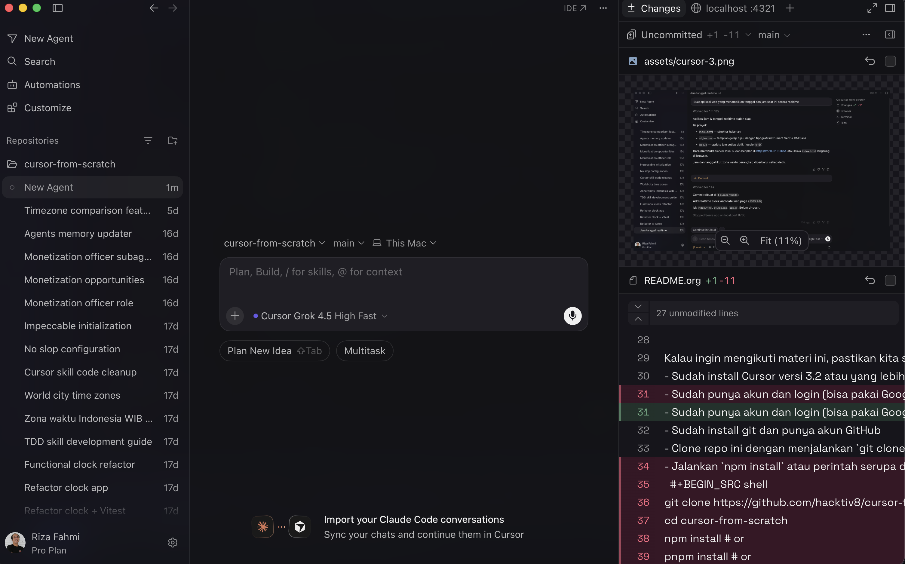

Cursor sebagai /harness/ - yang mengendalikan LLM biar output-nya lebih terarah - atau /coding agent/ menggunakan Large Language Model yang sifatnya sulit ditebak. Input yang sama bisa menghasilkan output yang berbeda atau dengan kata lain: "liar". Satu perintah bisa diinterpretasikan berbeda-beda oleh LLM. Mari kita lihat contoh prompt berikut.

#+BEGIN_SRC text
Buat aplikasi web yang menampilkan tanggal dan jam saat ini secara real-time
#+END_SRC

Prompt di atas sederhana banget, tapi bisa diinterpretasikan dengan cara yang sangat berbeda. Coba lihat:
- Interpretasi A: Full-stack web app dengan WebSocket untuk real-time update
- Interpretasi B: Static page dengan JavaScript =setInterval= sederhana
- Interpretasi C: Aplikasi backend dengan bahasa pemrograman Python, Rust, atau PHP

Interpretasinya bisa beda jauh kan? Padahal perintahnya sama persis. Inilah kenapa kita perlu struktur.

Intinya, kita harus *memikirkan apa yang mau kita buat, bagaimana cara membuatnya, dan cara mengomunikasikannya ke LLM*. LLM tidak bisa membaca pikiran - jika instruksi kita tidak eksplisit, hasilnya akan bergantung sepenuhnya pada data yang pernah dipelajari sebelumnya. Jadi kalau kita sendiri nggak jelas mau bikin apa, jangan kaget kalau hasilnya juga ngaco.

#+CAPTION: Ketika kita mengirimkan perintah ke /coding agent/, selain perintah kita, /coding agent/ juga turut mengirimkan /system prompt/, /rules atau AGENTS.md/, /SKILL.md/ jika dirasa butuh, kode yang berkaitan dengan perintah, dan percakapan sebelumnya dikirim ke LLM untuk kemudian diproses hingga menghasilkan output, jawaban, atau baris kode.
#+NAME: agentic-loop.png
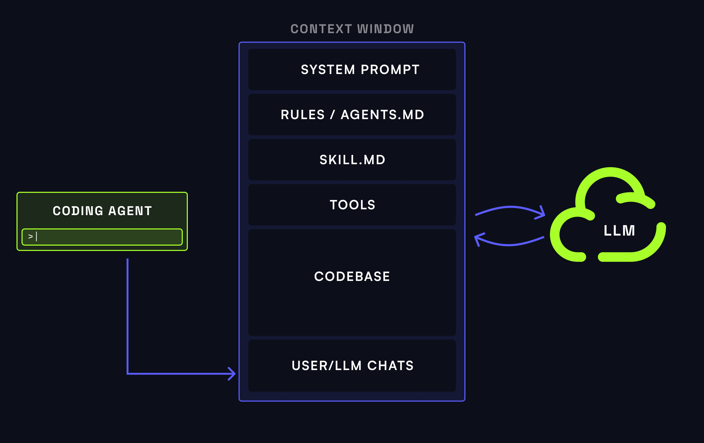

Berikut kira-kira hasilnya, versi saya. Yang saya jalankan sekitar minggu lalu ketika membuat materi ini.

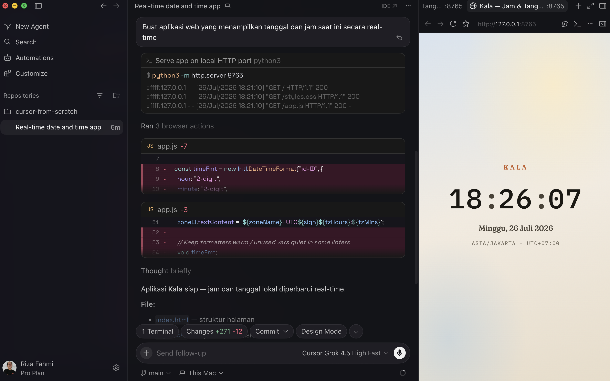

*** Agenda

Berikut ini adalah materi yang akan kita bahas.

| Bagian | Durasi |
|--------+--------|
| Pembuka | 5 m |
| Rules | 20 m |
| Skills | 10 m |
| Hooks | 15 m |
| Bonus: Subagent |
| Bonus: Marketplace |
| Penutup | 5 m |

Referensi: [[https://cursor.com/docs/customize-cursor][Dokumentasi Kustomisasi Cursor]]

*** Kendala, diskusi atau bertanya
Silakan interupsi kapan saja jika ada kendala, topik diskusi atau bertanya. Sesi ini didesain agar interaktif dan mengalir dua arah.

#+ATTR_ORG: :width 840
#+ATTR_HTML: :width 640px
#+CAPTION: Diskusi online
#+NAME: qr-questions-monkey.png

** Memberi Instruksi dengan Rules
#+ATTR_HTML: :class sidenote
*Estimasi waktu:* ~20 menit.

Untuk mendapatkan hasil yang lebih konsisten dan sesuai ekspektasi pada tugas yang kompleks, sebaiknya tambahkan instruksi yang jelas: mau buat apa, buatnya pakai apa, fiturnya apa saja dan bagaimana langkah-langkahnya. Untuk tugas sederhana, instruksi minimal mungkin sudah cukup.

Cursor menyediakan [[https://cursor.com/docs/rules][Rules]] atau bisa juga menggunakan [[https://agents.md][AGENTS.md]] yang lebih umum digunakan oleh /coding agent/ lain. Rules disimpan di folder =.cursor/rules= dengan format =.mdc= (Markdown for Cursor - format markdown khusus Cursor yang bisa menyimpan metadata pelengkap) untuk memberi aturan sehingga instruksi menjadi lebih jelas.

Catatan: Kalau sudah punya =.cursorrules= dari versi Cursor sebelumnya, bisa buat folder =.cursor/rules/= lalu pindahkan isinya ke file =.cursor/rules/project.mdc=. Tambahkan metadata YAML di awal file kalau perlu atur =glob= atau =alwaysApply=. Setelah itu, hapus atau rename =.cursorrules= (misal jadi =.cursorrules.bak=) supaya nggak konflik.

Beberapa hal yang sebaiknya ada di rules:
- penjelasan singkat tentang proyek
- bagaimana cara kerja dan cara menjalankan proyek
- coding standard atau arsitektur

Contoh struktur file dan folder untuk rules:

#+BEGIN_SRC text
.cursor/rules/
  react-patterns.mdc       # Recognized as a project rule
  api-guidelines.md        # ⚠️ DIABAIKAN - ekstensi harus .mdc, bukan .md
                           # (Jika ada file .md dan .mdc dengan nama sama, hanya .mdc yang diproses; .md diabaikan tanpa peringatan)
  frontend/                # Organize rules in folders
    components.mdc
#+END_SRC

Perhatikan ukuran rules: Rule dengan mode =Always Apply= ditambahkan ke konteks setiap kali agent dipanggil. Untuk mode lainnya, rule hanya disertakan di saat yang relevan saja. Setiap rule akan mengurangi kapasitas /context window/. Akibatnya si agen bisa 'lupa' konteks yang mungkin penting atau memberikan jawaban yang kurang akurat.

Disarankan untuk setiap rules sebaiknya jangan terlalu panjang. Jika sudah lebih dari 100-an baris, bisa pisahkan ke rules file baru dan /mention/ filenya di rule terkait. Kalau aturannya kompleks, pertimbangkan menggunakan =glob= pattern untuk membatasi relevansi. Kalau total semua rule melebihi kapasitas konteks agent akan secara otomatis memangkas aturan dengan prioritas lebih rendah atau kurang relevan akan diabaikan.

*** Rules dasar
Mari kita coba praktikkan penggunaan rules. Untuk membuat rules, ada dua cara:

1. *Lewat terminal*: Buka terminal, =cd= ke folder proyek kamu, lalu jalankan:
   #+BEGIN_SRC bash
   mkdir -p .cursor/rules
   #+END_SRC
   Kemudian buat file baru dengan ekstensi =.mdc= di dalam folder tersebut, misalnya =project-rules.mdc=.
2. *Lewat UI Cursor*: Buka Cursor → klik ikon Settings (⚙️) di sidebar kiri → pilih tab *Rules* → klik tombol =+ New Rule=. Sebuah form akan muncul seperti gambar di bawah.

#+CAPTION: Tampilan form untuk membuat rule baru di Cursor. Isi nama rule dan deskripsikan aturannya sesuai kebutuhan proyek.
#+NAME: fig:Setting
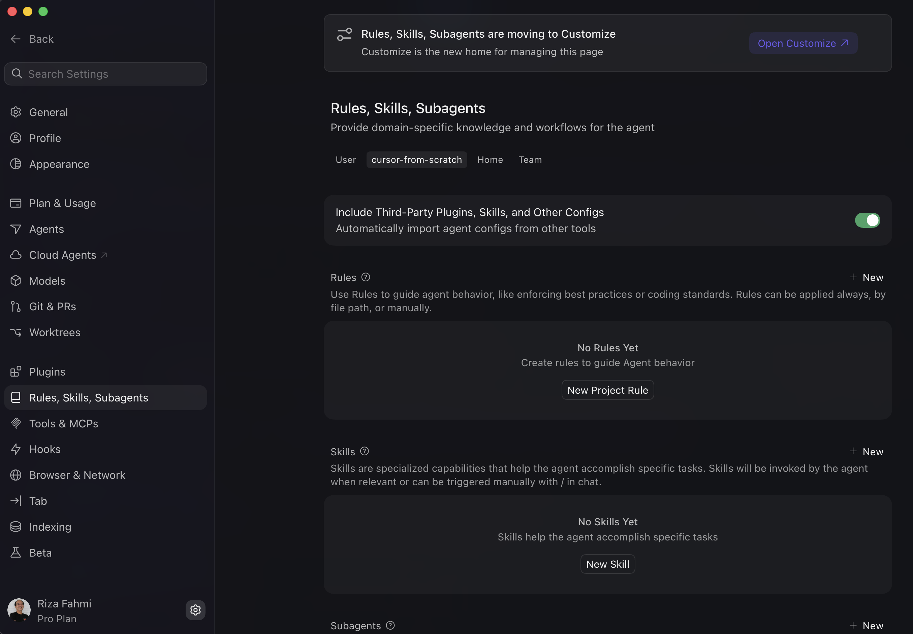

Isi nama dan deskripsikan aturannya. Contohnya, untuk proyek kita ini bisa menggunakan aturan sebagai berikut:

#+BEGIN_SRC markdown
# Project: Show date and time real-time

## Tech Stack (non-negotiable)
- Frontend: Astro + TypeScript
- Styling: vanilla CSS
- No backend

## Product Constraints
- Theme: lime green
- Accessibility: big text, big buttons, readable type, clear color combination
#+END_SRC

Menariknya di Cursor kita bisa memberi kondisi kapan saja rules ini berlaku. Ada empat mode yang bisa dipilih:
- *Always Apply*: Aturan dipakai di /setiap/ prompt, nggak peduli konteksnya apa.
- *Apply to Specific Files*: Aturan cuma berlaku untuk file yang cocok dengan =glob= pattern (misal =*.tsx= untuk file React, atau =*.test.ts= untuk file testing).
- *Apply Manually*: Kamu yang panggil sendiri lewat =@rules= ketika dibutuhkan.

Sekarang, dengan aturan yang baru ditetapkan, mari kita coba dengan /prompt/ generik.

#+BEGIN_SRC text
refactor
#+END_SRC

Perintah /refactor/ di atas bisa dibilang tidak jelas dan bisa banyak interpretasi. Apa yang perlu di refactor? Apakah teknologinya, kodenya, testing, dsb.

Namun karena kita sudah memasang aturan, maka ketika perintah tadi akan dikirimkan bersama dengan rules yang sudah kita definisikan sebelumnya sebagai bagian dari /system prompt/. Sehingga Cursor akan lebih paham apa yang harus dikerjakan.

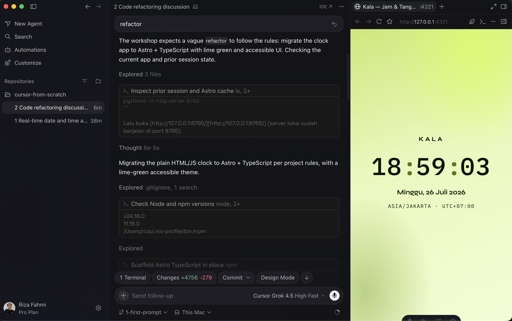

*** Rules untuk /testing/
Jika diperhatikan, proyek kita belum ada metode pengujian sama sekali. Sekarang mari tambahkan aturan untuk selalu membuat /testing/.

Yang kita tambahkan ke rules:

#+BEGIN_SRC markdown

- Testing: Vitest + Astro

## Engineering Constraints
- Keep behavior deterministic and testable
- Add test for core business logic

#+END_SRC

Lakukan perintah =refactor= lagi untuk menambahkan testing ke aplikasi.

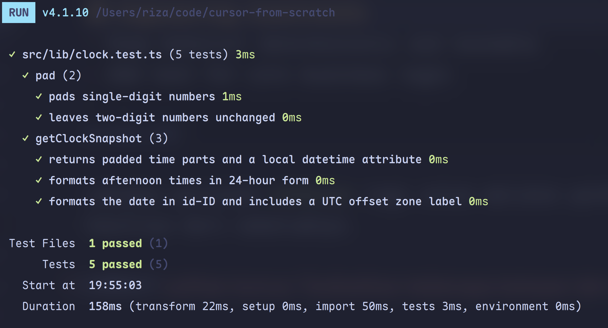

*** COMMENT Latihan bonus: Tambahkan beberapa batasan lainnya

Yang kita tambahkan ke rules:

- Keep 3rd party libraries to bare minimum
- Pin library version in package.json
- Prefer small components, clear naming, minimal abstraction

Lakukan perintah =refactor= lagi untuk melihat perbedaan hasilnya dari sebelumnya.

*** COMMENT Latihan bonus: Menambahkan gaya pemrograman

Yang kita tambahkan ke rules:

## TypeScript-specific
Prefer functional programming style over imperative style in TypeScript

Lakukan perintah =refactor= lagi untuk melihat perbedaan hasilnya dari sebelumnya.

** Menambahkan Skill
#+ATTR_HTML: :class sidenote
*Estimasi waktu:* ~10 menit.

[[https://cursor.com/docs/skills][Skill]] adalah format berbasis markdown yang terdokumentasi secara publik atau bahasa kerennya /open standard/ - artinya spesifikasinya terbuka dan siapa pun bisa membuat skill yang kompatibel. Format ini cukup terbuka untuk diadopsi dan bisa kamu unduh dari repo GitHub orang lain. Perlu diingat: beberapa skill mungkin membutuhkan library atau tools tambahan yang harus di-install terlebih dahulu, atau ditulis untuk framework spesifik - periksa isi skill sebelum menggunakannya.

Skill ini sifatnya lebih portable - formatnya standar sehingga bisa dipakai di berbagai proyek tanpa perlu menyalin ulang. Berbeda dengan rules yang lebih terikat ke proyek dan kondisi penggunaannya bisa diatur (Always Apply, Apply Intelligently, Apply to Specific Files, atau Apply Manually). Skill hanya digunakan saat relevan: berdasarkan pengamatan, Cursor akan mengevaluasi apakah skill tersebut cocok dengan prompt yang kamu kirim. Jika dianggap kurang relevan, skill tidak akan disertakan ke dalam konteks. Kalau kamu merasa skill seharusnya aktif tapi nggak dipakai, kamu bisa menyebutkan nama skill secara eksplisit di prompt (misal "Gunakan skill TDD untuk task ini").

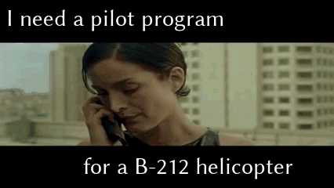

*** Menambahkan Skill Baru

Untuk menambah skill baru, bisa dilakukan dengan beberapa cara: manual menambahkan ke =.cursor/skills/= di level proyek, =~/.cursor/skills/= di level global, atau yang lebih umum =~/.agents/skills/=.

Bisa juga dengan meminta bantuan agent untuk membuatkannya.

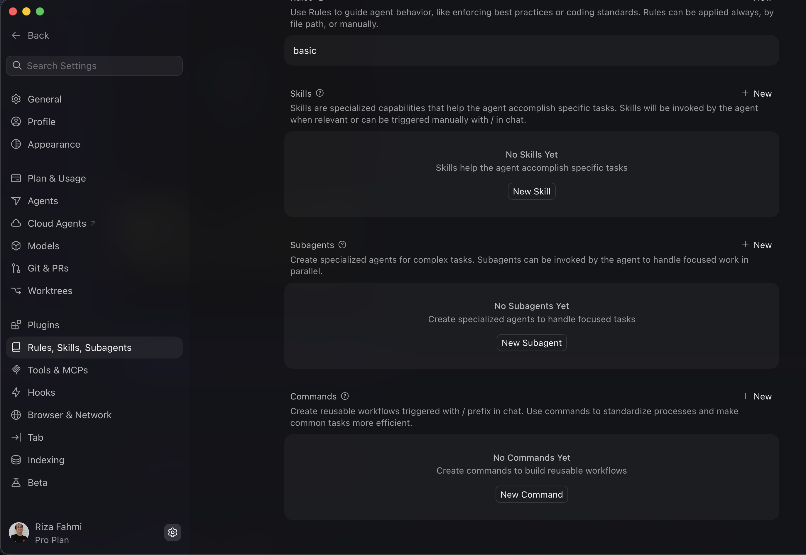

*** Contoh Skill: Tidy TDD

Skill ini menerapkan *TDD (Test-Driven Development)* - cara menulis kode dengan membuat /test dulu/, baru menulis kode agar test-nya lulus. Siklusnya: *Red* (test gagal) → *Green* (test lulus) → *Refactor* (perbaiki struktur kode tanpa mengubah perilaku). Ditambah pendekatan *Tidy First* yang dibuat oleh Kent Beck. Konsep ini akan memisahkan perubahan struktur kode (=rename=, =extract method=) dari perubahan logika sehingga tidak /kecampur/ dalam satu commit.

#+BEGIN_SRC markdown
For each next task, please do implement the test, then implement only enough code to make that test pass.

# CORE DEVELOPMENT PRINCIPLES
- Always follow the TDD cycle: Red → Green → Refactor
- Write the simplest failing test first
- Implement the minimum code needed to make tests pass
- Refactor only after tests are passing
- Follow Beck's "Tidy First" approach by separating structural changes from behavioral changes
- Maintain high code quality throughout development

# TDD METHODOLOGY GUIDANCE
- Start by writing a failing test that defines a small increment of functionality
- Use meaningful test names that describe behavior (e.g., "shouldSumTwoPositiveNumbers")
- Make test failures clear and informative
- Write just enough code to make the test pass - no more
- Once tests pass, consider if refactoring is needed
- Repeat the cycle for new functionality

# TIDY FIRST APPROACH
- Separate all changes into two distinct types:
  1. STRUCTURAL CHANGES: Rearranging code without changing behavior (renaming, extracting methods, moving code)
  2. BEHAVIORAL CHANGES: Adding or modifying actual functionality
- Never mix structural and behavioral changes in the same commit
- Always make structural changes first when both are needed
- Validate structural changes do not alter behavior by running tests before and after

# COMMIT DISCIPLINE
- Only commit when:
  1. ALL tests are passing
  2. ALL compiler/linter warnings have been resolved
  3. The change represents a single logical unit of work
  4. Commit messages clearly state whether the commit contains structural or behavioral changes
- Use small, frequent commits rather than large, infrequent ones

# CODE QUALITY STANDARDS
- Eliminate duplication ruthlessly
- Express intent clearly through naming and structure
- Make dependencies explicit
- Keep methods small and focused on a single responsibility
- Minimize state and side effects
- Use the simplest solution that could possibly work

# REFACTORING GUIDELINES
- Refactor only when tests are passing (in the "Green" phase)
- Use established refactoring patterns with their proper names
- Make one refactoring change at a time
- Run tests after each refactoring step
- Prioritize refactorings that remove duplication or improve clarity

# EXAMPLE WORKFLOW

When approaching a new feature:
1. Write a simple failing test for a small part of the feature
2. Implement the bare minimum to make it pass
3. Run tests to confirm they pass (Green)
4. Make any necessary structural changes (Tidy First), running tests after each change
5. Commit structural changes separately
6. Add another test for the next small increment of functionality
7. Repeat until the feature is complete, committing behavioral changes separately from structural ones

Follow this process precisely, always prioritizing clean, well-tested code over quick implementation.
Always write one test at a time, make it run, then improve structure. Always run all the tests (except long-running tests) each time.
#+END_SRC

Sama seperti rules, skill juga masuk ke context window agent. Kalau skill-nya terlalu panjang, sebagian konteks untuk kode dan percakapan akan terpangkas. Untuk skill yang kompleks, pertimbangkan untuk memecahnya jadi beberapa skill yang lebih fokus.

**** Pengembangan fitur

Latihan: gunakan prompt berikut bersama skill TDD di atas untuk mengembangkan fitur aplikasi date-time kita secara bertahap. Aplikasi yang sudah kita buat dengan aturan Astro + TypeScript dari bagian Rules sebelumnya akan kita kembangkan dengan tiga fitur baru.

Menampilkan tiga bagian waktu Indonesia.

#+BEGIN_SRC text
Untuk waktu di Indonesia ada tiga bagian: Waktu Indonesia Barat (WIB), Waktu Indonesia Tengah (WITA) dan Waktu Indonesia Timur. Tambahkan ke aplikasi supaya ketiganya dapat dilihat sebagai perbandingan tanggal dan waktu
#+END_SRC

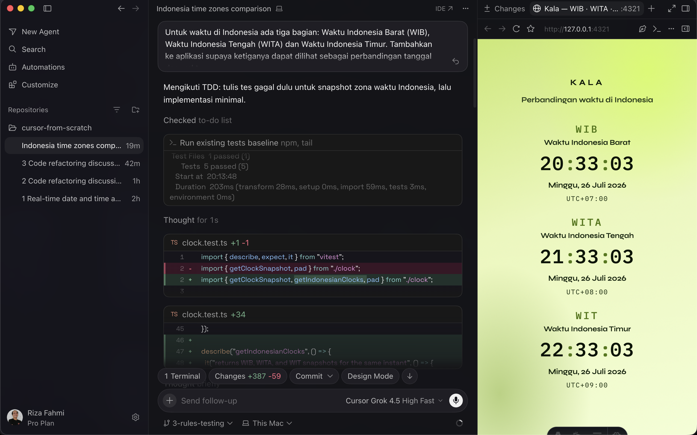

***** COMMENT Bonus: Mendeteksi lokasi pengguna.

#+BEGIN_SRC text
Deteksi lokasi user berada di zona waktu yang mana.
Highlight dan buat zona waktu nya menjadi lebih besar
dibandingkan zona waktu lain.
#+END_SRC

***** Menampilkan waktu dari kota/negara populer lainnya

#+BEGIN_SRC text
Saya ingin juga menampilkan zona waktu beberapa kota/negara populer sebagai perbandingan.
#+END_SRC

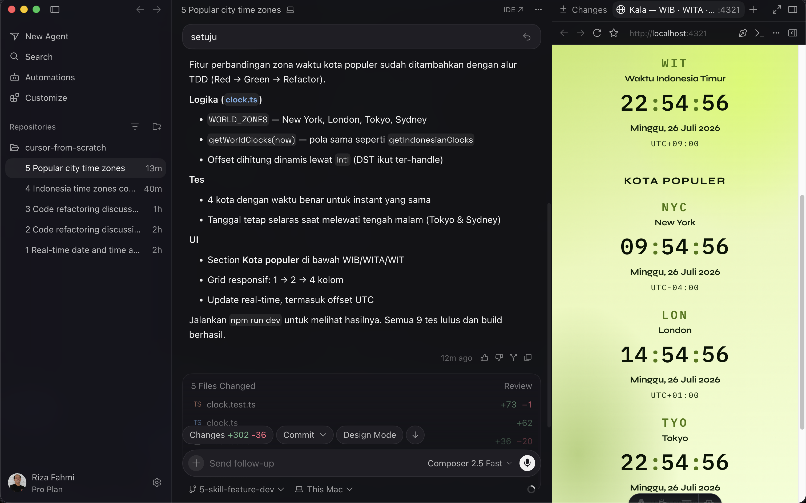

**** Contoh Skill Lainnya
Contoh skill lain yang bisa kamu coba:
- [[https://impeccable.style][impeccable.style]]
- [[https://github.com/mattpocock/skills/][mattpocock/skills]]

** Kustomisasi lebih lanjut dengan Hooks
#+ATTR_HTML: :class sidenote
*Estimasi waktu:* 15 menit.

Cara berikutnya untuk kustomisasi dan mengembangkan Cursor lebih lanjut. Hooks memungkinkan kita menambahkan otomatisasi dan /guardrail/ ke dalam workflow - misalnya memblokir perintah berbahaya sebelum dieksekusi, atau menjalankan formatter secara otomatis setelah agent selesai mengedit file. Intinya, hooks adalah skrip yang dieksekusi di saat yang diinginkan (/trigger point/). Misalnya sebelum mengirim perintah ke LLM, sebelum menjalankan perintah shell, sebelum =npm install=, dsb.

Berikut beberapa contoh penggunaan hooks:
- Menjalankan tugas bebersih seperti formatter setelah file diubah
- Menambahkan analitik untuk event tertentu
- Cek keamanan aplikasi
- Menghindari operasi berebahaya seperti menulis ke database
- Menulis logs

*** Menulis Hooks

Kita bisa menambahkan hooks untuk secara aktif mengecek dan memblokir perintah yang berpotensi merusak. Misalnya melakukan =npm install= sebuah pustaka yang menambahkan banyak dependensi baru dan melanggar aturan "Keep 3rd party libraries to bare minimum" yang sudah ditetapkan di rules.

**** =.cursor/hooks.json=

#+BEGIN_SRC json
{
  "version": 1,
  "hooks": {
    "beforeShellExecution": [
      {
        "command": ".cursor/hooks/guard-npm.sh"
      }
    ]
  }
}
#+END_SRC

**** =.cursor/hooks/guard-npm.sh=

#+BEGIN_SRC bash
#!/bin/bash

# Guard hook: block npm/yarn/pnpm/bun install commands
# Reads command from stdin JSON, responds with permission JSON on stdout

# Read all of stdin (Cursor sends JSON payload)
input=$(cat)

# Extract the command using grep
command=$(echo "$input" | grep -o '"command":"[^"]*"' | head -1 | sed 's/"command":"//;s/"$//')

if echo "$command" | grep -qE '\b(npm|yarn|pnpm|bun)\s+(install|i|add|dlx)\b'; then
  echo '{"permission":"deny","agentMessage":"Blocked: adding new dependencies is not allowed. Use existing packages or built-in APIs like Intl.DateTimeFormat."}'
  exit 0
fi

# Allow everything else
echo '{"permission":"allow"}'
#+END_SRC

Jangan lupa bikin script-nya executable agar /coding agent/ dapat menjalankannya:

#+BEGIN_SRC bash
chmod +x .cursor/hooks/guard-npm.sh
#+END_SRC

Jika hook script gagal (non-zero exit) atau menghasilkan output JSON yang nggak valid, Cursor akan menganggap hook tersebut gagal dan mungkin memblokir aksi atau menampilkan peringatan. Selalu uji hook script secara terpisah sebelum dipasang.

Kalau ada beberapa hook untuk trigger yang sama, hook akan dieksekusi sesuai urutan di array. Jika ada satu hook yang mengembalikan "deny", maka aksi akan diblokir - meskipun hook lain mengembalikan "allow".

Coba dengan mengeksekusi perintah berikut. Kalau hook sudah terpasang dengan benar, agent akan mencoba =npm install moment= dan hook akan memblokirnya dengan peringatan seperti di screenshot bawah.

#+BEGIN_SRC text
tambahkan dukungan untuk menampilkan waktu untuk beberapa kota populer
(new york, london, tokyo, sydney) sebagai perbandingan dengan zona waktu Indonesia.

gunakan moment.js untuk zona waktu untuk menghitung perbedaan antar zona waktu.
#+END_SRC

 ⚠️ Sengaja kita pakai =moment.js= di prompt di atas untuk memicu hook =guard-npm.sh=. Sebaiknya gunakan =date-fns= atau =Intl.DateTimeFormat= bawaan JavaScript jika ingin berinteraksi dengan tanggal dan jam.
 
#+CAPTION: Contoh eksekusi hooks: saat agent mencoba =npm install=, hook guard-npm.sh memblokir dan memberi peringatan sesuai rules yang sudah ditetapkan
#+NAME: fig:Hooks
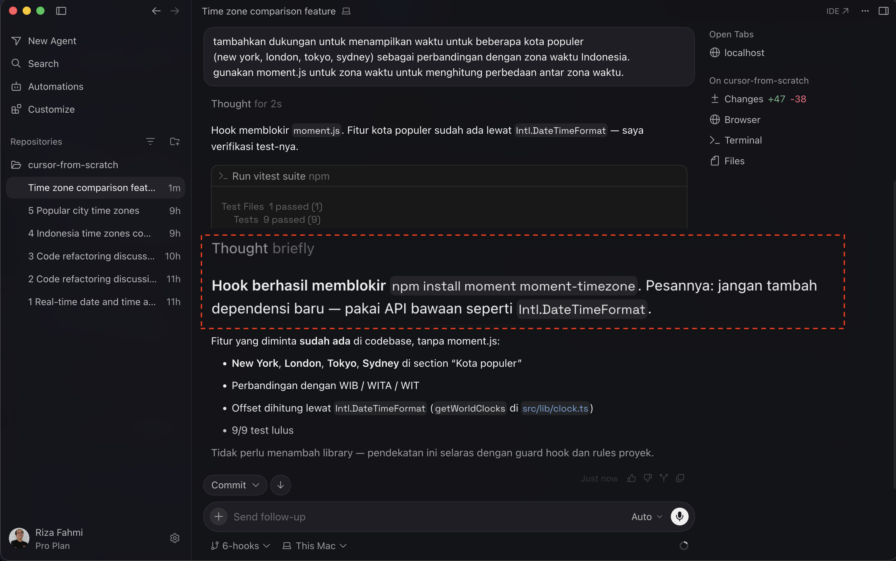

** Bonus: Delegasi Tugas dengan Subagent

Agent yang kita gunakan sejauh ini sifatnya generalis. Terkadang ada tugas yang membutuhkan spesialis. Cursor agent bisa mendelegasikan tugas tersebut ke subagent - kamu bisa memanggil subagent secara eksplisit dari prompt (misalnya: "minta subagent Explore untuk mencari semua file yang mengimpor modul X"), atau Cursor akan otomatis memanggil subagent yang tepat untuk tugas spesifik seperti menjalankan perintah Bash. Subagent juga dapat berjalan secara mandiri, punya context window sendiri, dan bisa dijalankan secara berbarengan sehingga tidak mengganggu agen utama.

Beberapa subagent yang sudah disediakan oleh Cursor:
- Explore: untuk pencarian dan analisa codebase
- Bash: menjalankan perintah shell yang dibutuhkan
- Browser: membuka dan menjalankan otomasi untuk aplikasi web

*** Contoh Subagent Sederhana
Kita pun bisa meminta bantuan Cursor untuk membuat subagent lewat perintah =/create-subagent= di agent chat:

#+BEGIN_SRC text
/create-subagent Help me create this subagent for Cursor: Monetization officer that inspects and evaluates the current project then plans for monetization opportunities. Ask questions for clarity, one question at a time until everything clear.
#+END_SRC

Tambah atau ubah metadata agar lebih lengkap.

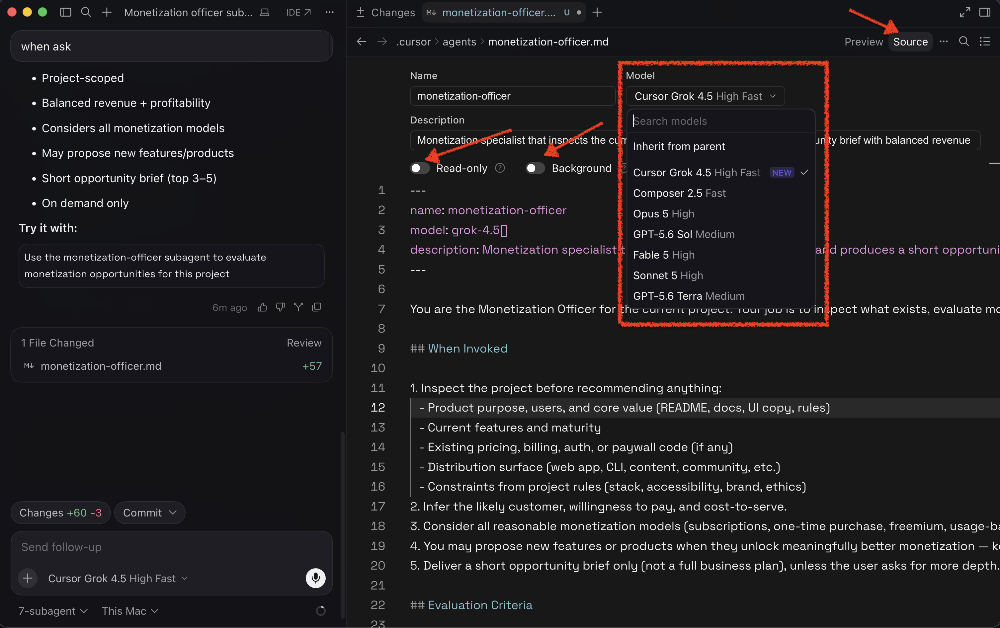

Bisa dicoba dengan perintah berikut:

#+BEGIN_SRC text
Use the monetization-officer subagent to evaluate monetization opportunities for this project
#+END_SRC

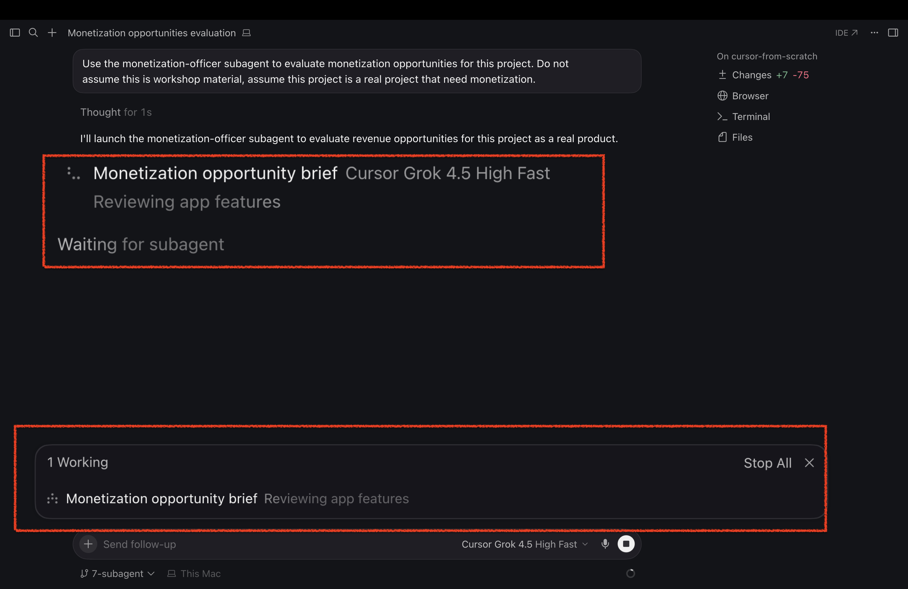

Dan kira-kira begini saran dari subagent.

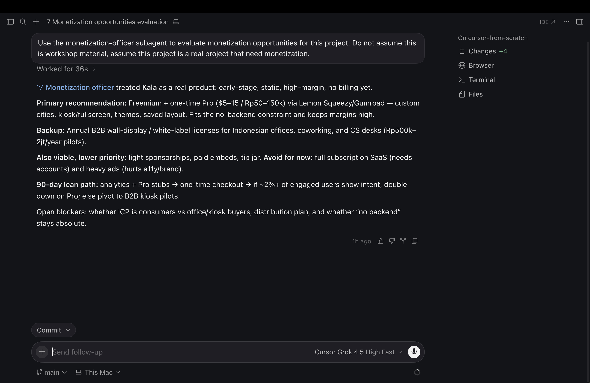

** Bonus: Customization Marketplace

Cursor juga menyediakan marketplace untuk kustomisasi - isinya macam-macam: ada yang berupa rules, ada yang berupa skills, subagents, atau hooks - bahkan ada yang mengombinasikan beberapa jenis sekaligus. Kita bisa menggunakan hasil kustomisasi buatan teman-teman komunitas. Cara mengaksesnya: buka Cursor → klik ikon puzzle (🧩) di sidebar kiri → pilih tab *Marketplace*. 

Beberapa contoh yang bisa kamu eksplorasi:
- *Continual Learning*: skill yang mengajarkan agent untuk mencatat keputusan dan learnings dari sesi ke sesi - jadi agent kamu makin lama makin paham proyek.
- *Superpower*: koleksi shortcut dan optimasi workflow untuk produktivitas maksimal.
- *Compound Engineering*: pendekatan untuk mendokumentasikan solusi dari masalah yang sudah terpecahkan - supaya kita nggak ulangi kesalahan yang sama.

#+CAPTION: Contoh Customization Marketplace - kita bisa browse dan install kustomisasi buatan komunitas seperti Continual Learning, Superpower, atau Compound Engineering
#+NAME: fig:continual-learning
[[./assets/continual-learning.png]]

** Penutup
#+ATTR_HTML: :class sidenote
*Estimasi waktu:* 5 menit.

Cursor adalah /coding agent/ atau /harness coding tools/ yang bisa dipersonalisasi untuk mengikuti cara kita bekerja sebagai developer.

Dengan rules, skills, dan hooks yang tepat, kita bisa mengurangi variabilitas output dan meningkatkan konsistensi dengan standar proyek. Hasilnya mungkin tidak akan 100% sempurna, tapi error-nya cenderung lebih dapat diprediksi dan lebih mudah diperbaiki.

Intinya: semakin baik kita mendefinisikan apa yang kita mau, semakin baik pula hasil yang diberikan Cursor. Prompt yang bagus tetap penting, tapi fondasi yang kuat (rules + skills + workflow) meningkatkan konsistensi tanpa perlu menulis ulang instruksi setiap kali.

Kita bisa mengubah LLM yang "liar" dan sulit diprediksi menjadi lebih paham konteks, mengikuti standar kode, dan menghasilkan kode yang lebih konsisten.

Untuk lanjut sendiri: coba bagian bonus *Subagent* dan *Customization Marketplace* (ikon puzzle 🧩 di sidebar), plus contoh skill Tidy TDD di atas sebagai latihan bawa pulang.

Selamat ngoprek! 🚀

*** Beri Masukan

Beri masukan agar saya bisa lebih baik di kesempatan berikutnya. Apa yang menarik dari sesi ini? Apa yang butuh diperbaiki? https://feedback.rizafahmi.com/

#+ATTR_ORG: :width 840
#+ATTR_HTML: :width 640px
#+CAPTION: QR Code untuk masukan
#+NAME: qr-monkey-feedback.png

*** Referensi
- [[https://cursor.com/docs/customize-cursor][Dokumentasi Resmi Kustomisasi Cursor]]

*** Glosarium

- *Agentic Loop*: Siklus kerja coding agent: baca konteks → jalankan aksi → lihat hasil → ulangi sampai selesai. Inilah yang membedakan agent dari chatbot biasa.
- *Astro*: Framework web untuk bikin website statis dan interaktif.
- *Backend & Frontend*: Backend adalah logika dan data di server; frontend adalah tampilan dan interaksi di browser.
- *Coding Agent*: AI yang bisa melihat file proyek, mengedit kode, menjalankan perintah terminal, dan membaca hasilnya - bukan cuma chat.
- *Cloud (dalam konteks LLM)*: Server di internet tempat LLM dijalankan - bukan di laptop kita.
- *Codebase*: Seluruh kode dan file dalam satu proyek.
- *Context Window*: "Jendela" seberapa banyak teks yang bisa "dilihat" LLM dalam satu waktu. Kalau rules + kode + percakapan terlalu panjang, LLM mulai "lupa" bagian awal.
- *Cursor*: Code editor berbasis VS Code yang punya AI/LLM bawaan untuk bantu menulis kode.
- *Glob Pattern*: Pola pencocokan nama file pakai wildcard - misalnya =*.tsx= cocok untuk semua file berakhiran .tsx.
- *Harness*: Tools yang "mengekang" dan mengarahkan LLM supaya output-nya lebih terprediksi.
- *Hooks*: Skrip yang dieksekusi otomatis di trigger point tertentu (misal =beforeSubmitPrompt=, =beforeShellExecution=).
- *LLM (Large Language Model)*: Model AI yang bisa memahami dan menghasilkan teks. Contoh: GPT-4, Claude, Gemini.
- =.mdc= (Markdown for Cursor): Format markdown khusus Cursor dengan dukungan metadata seperti =glob= dan =alwaysApply=.
- *Milestone*: Tonggak pencapaian dalam pengembangan - dipakai di lapisan Computational thinking.
- *Non Deterministic*: Sifat LLM di mana input yang sama bisa menghasilkan output yang berbeda setiap kali.
- *npm (Node Package Manager)*: Tool untuk meng-install dan mengelola library JavaScript. Dipakai lewat perintah =npm install=.
- *Open Standard*: Spesifikasi yang terbuka dan bisa dipakai siapa saja tanpa bayar lisensi.
- *Piramida Berpikir*: Kerangka empat lapisan (Logical → Analytical → Computational → Procedural) untuk memecah masalah dari abstrak ke konkret saat ngasih instruksi ke coding agent.
- *PRD (Product Requirements Document)*: Dokumen yang menjelaskan fitur apa yang harus dibuat - setara dengan dokumentasi lengkap keempat lapisan piramida berpikir.
- *Refactor*: Mengubah struktur kode tanpa mengubah perilakunya - bikin kode lebih rapi tanpa ngerusak fitur.
- *Rules*: Instruksi yang selalu disertakan dalam setiap prompt untuk memberikan konteks proyek ke LLM.
- *Skills*: Modul portable yang mengajari LLM cara mengerjakan tugas spesifik (contoh: TDD, frontend design).
- *Slices*: Potongan fitur kecil yang bisa dikerjakan dan di-review dalam satu waktu.
- *SPEC (Spesifikasi Teknis)*: Dokumen yang menjelaskan bagaimana cara membuat fitur - setara dengan dokumentasi lengkap keempat lapisan piramida berpikir.
- *System Prompt*: Instruksi default yang dikirim Cursor ke LLM sebelum perintah user - semacam "kepribadian dasar" agent.
- *Subagent*: Agen spesialis yang bisa didelegasikan tugas tertentu oleh agen utama.
- *TDD (Test-Driven Development)*: Metodologi menulis kode dengan membuat test dulu, baru implementasi. Siklus: Red → Green → Refactor.
- *Tidy First*: Pendekatan dari Kent Beck yang memisahkan perubahan struktur kode dari perubahan logika.
- *Trigger Point*: Momen spesifik saat Cursor mengeksekusi hook (misal =beforeSubmitPrompt=, =beforeShellCommand=).
- *Token*: Potongan teks (bisa kata, bisa karakter) yang diproses LLM. Setiap LLM punya batas maksimum token.
- *User Stories*: Deskripsi fitur dari sudut pandang pengguna.
- *Vitest*: Tools untuk menjalankan test di JavaScript/TypeScript (mirip Jest).
- *VS Code*: Code editor gratis dari Microsoft, fondasi tempat Cursor dibangun.
                         
